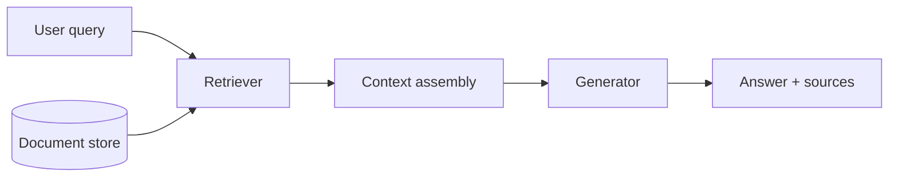
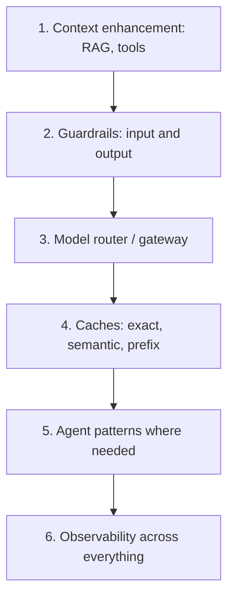

# AI Engineering Reference

Technique catalog distilled in our own words from *AI Engineering* (Chip Huyen, O'Reilly 2025).
Read the section relevant to your current task; do not try to apply everything at once.

## 1. Model behavior

Foundation models are probabilistic: the same input can produce different outputs across runs.
Two consequences follow: responses are inconsistent, and models hallucinate (they generate plausible but unsupported content).
Design every downstream system assuming both.

### Sampling parameters

| Parameter | Effect | Practical guidance |
|---|---|---|
| `temperature` | Flattens or sharpens the token distribution | 0 for deterministic tasks (extraction, classification); higher for brainstorming |
| `top_p` | Keeps only the smallest token set whose cumulative mass reaches p | Tune either this or temperature, not both |
| `top_k` | Samples only from the k most likely tokens | Coarser than top_p; rarely needed alongside it |
| `seed` | Fixes the RNG | Useful for reproducible evals, if the server honors it |

Deterministic settings reduce variance but never eliminate it; batching and numerical effects on the serving side also change outputs.

### Structured outputs

When code consumes the model's response, constrain the format instead of parsing prose.
Prefer tool calling or JSON-schema-guided decoding when the server supports it; fall back to prompting with a strict format plus a validation-and-retry loop.
Always validate against a schema (Pydantic) before using the data.

### Test time compute

Letting the model generate intermediate reasoning before the final answer improves quality on complex tasks, at the cost of latency and tokens.
Use it for hard reasoning; skip it for simple lookups.

## 2. Evaluation

Evaluation is the hardest part of AI engineering and the one most teams underinvest in.

### Why it is hard

- Open-ended tasks have no single correct answer.
- Models are inconsistent, so a one-off manual check proves nothing.
- Public benchmarks measure generic capability, not your application's behavior, and many are contaminated by training data.

### Exact evaluation

Use it whenever a ground truth exists: functional correctness for code (run the tests), exact match for closed-form answers, string or embedding similarity against reference texts.
Embedding similarity measures semantic closeness, not factual correctness; a fluent wrong answer can still score high.

### LLM-as-judge

Use a model to grade another model's output when no exact metric exists.

- Give the judge an explicit rubric with concrete score definitions.
- Ask for one criterion per judgment; multi-criteria scores are noisy.
- For open-ended comparisons, prefer pairwise comparison over absolute scoring.
- Validate the judge against human labels on a sample before trusting it.
- Known biases: judges favor longer answers, answers from the same model family, and the first option in a comparison.
  Randomize option order and keep answers comparable in length.
- A cheaper, weaker model can judge objective criteria (format compliance, citation presence) reliably; reserve strong judges for subjective criteria.

### Evaluation pipeline design

1. Evaluate every component of the system separately (retriever, prompt, tools, guardrails), not just end-to-end.
2. Write an evaluation guideline: what "good" means per criterion, with examples.
3. Define methods and data: eval set source, judge configuration, pass thresholds.
4. Run evals on every change to prompts, models, retrieval, or tools, and track results over time.

Treat the eval set as a living asset: every production failure becomes a new eval case.

## 3. Prompt engineering

### Best practices

- Write clear, explicit instructions; assume the model knows nothing about your intent.
- Put the task definition, output format, and constraints in the system prompt; keep user input separate.
- Provide sufficient context; the model cannot use knowledge it does not have and you did not give it.
- Break complex tasks into simpler subtasks, in one prompt or across a pipeline.
- Give the model time to think: ask for reasoning before the answer on hard problems.
- Iterate with versioning; a prompt change is a code change and should be tested like one.

### In-context learning

- Zero-shot first; add few-shot examples only when zero-shot underperforms.
- Few-shot examples teach format and edge-case behavior; their number, order, and diversity all affect output.
- Context is finite: long contexts cost money, add latency, and models use the middle of long contexts poorly.
  Trim aggressively and measure context efficiency.

### Defensive prompting

Assume adversarial users.

- Jailbreaking: users trick the model into ignoring its instructions.
- Prompt injection: malicious instructions arrive inside retrieved content or tool output, not just from the user.
  This is the dominant attack vector for RAG and agentic systems.
- Information extraction: attackers probe for system prompts, proprietary instructions, or data in context.

Defenses stack; none is sufficient alone:

1. Keep secrets out of prompts entirely; a system prompt is not a secret store.
2. Separate instructions from untrusted data (delimiters, role separation, marking retrieved content as data).
3. Add input guardrails (injection pattern detection, off-topic classifiers).
4. Add output guardrails (format validation, PII and toxicity checks, constrained fallback responses).
5. Limit blast radius: read-only tools by default, scoped permissions, human approval for write actions.

## 4. RAG

RAG fixes knowledge problems: missing, private, or fresh information.
It does not fix reasoning, format, or behavior problems.

### Architecture

Evaluate the retriever and the generator separately; a bad answer can come from either.

### Retrieval algorithms

| Approach | Strengths | Weaknesses |
|---|---|---|
| Term-based (BM25) | Exact keyword precision, cheap, no training | Misses synonyms and paraphrases |
| Embedding-based | Semantic similarity, paraphrase robust | Misses rare tokens, IDs, exact codes |
| Hybrid | Combines both; usually best in practice | More moving parts to tune and evaluate |

### Retrieval optimization

- Chunking is the highest-leverage decision: too small loses context, too large dilutes relevance and wastes tokens.
  Match the strategy to the document structure (sections, functions, conversations) before tuning chunk sizes.
- Rerank retrieved candidates with a cross-encoder or LLM before putting them in context; it is usually cheaper than a bigger generator.
- Rewrite or expand the user query when queries are vague, multi-part, or conversational.
- More context is not better context: irrelevant chunks actively degrade generation.
  Measure answer quality versus number of chunks.

### RAG beyond text

Tables, images, and multimodal documents need dedicated parsing and often separate indexes.
Do not assume a text pipeline transfers.

## 5. Agents

An agent is a model that decides what to do next in a loop: observe, plan, act with tools, repeat.

### Tools

Tools are how an agent perceives and acts.
Three categories: knowledge augmentation (search, retrieval), capability extension (calculators, code execution), and write actions (send, create, modify).

- Fewer, well-described tools beat many overlapping ones; tool confusion is a top failure cause.
- Give each tool a precise name, description, and typed schema; the description is part of the prompt.
- Default to read-only tools; gate write actions behind explicit approval.
- Verify tool calling actually works on your model endpoint before building on it.

### Planning

- Simple tasks need no planner; a fixed pipeline is cheaper and more reliable.
  Add planning only when the task is genuinely open-ended.
- Plan-then-execute separates planning from acting and makes plans auditable and correctable before execution.
- Set explicit budgets: max steps, max tokens, max wall time.
  Unbounded loops are the most common production incident for agents.
- Build in reflection: let the agent detect a failed tool call or a bad plan and retry with a different approach.

### Failure modes and evaluation

Evaluate at two levels: end-to-end task success, and per-step traces (tool choice, parameters, plan quality).
Common failure modes: wrong tool, right tool with wrong parameters, hallucinated tools, infinite loops, premature termination, and plausible-but-wrong final answers.
Agent failures compound across steps, so a 90% per-step success rate means roughly 60% success over five steps.

### Memory

Decide explicitly what the agent remembers: conversation history, extracted facts, user preferences, past task outcomes.
Scope it (per session, per user, global), give it a retention policy, and design how memories are written and retrieved.
Memory that is never retrieved is storage cost without value; memory retrieved at the wrong time pollutes the context.

## 6. Finetuning

Finetuning changes how a model behaves; RAG changes what a model knows.

Finetune when: you need a specific output format or style at scale, prompting hit context or cost limits, or you must run a smaller model with big-model behavior on a narrow task.

Do not finetune when: prompting plus RAG already passes evals, the problem is missing knowledge, or you lack quality data and the capacity to maintain it.

- PEFT methods (LoRA and relatives) train a small set of adapter weights instead of the full model, cutting memory needs by an order of magnitude and keeping the base model reusable.
- Model merging combines finetuned variants by weight arithmetic; useful for multi-task behavior without joint training.
- Finetuning is a commitment: dataset engineering, training infrastructure, evaluation, and ongoing retraining as knowledge drifts.
  Budget for all of it or stay on prompting and RAG.

## 7. Dataset engineering

Data quality beats data quantity for finetuning and for few-shot example banks.

- Curation: cover the real distribution of inputs, including edge cases and failure modes; annotate with clear guidelines.
- Synthesis: use a strong model to generate training or eval data, but validate it; synthetic data inherits the generator's biases and errors.
- Distillation: train a small model on a large model's outputs to get most of the quality at a fraction of the serving cost.
- Processing: inspect samples manually, deduplicate, filter low-quality or toxic content, and format consistently.
  Decontaminate eval data from training data.

## 8. Inference optimization

Measure before optimizing, and know the metrics:

| Metric | Meaning |
|---|---|
| TTFT (time to first token) | Perceived responsiveness; dominated by prompt processing |
| TPOT / ITL (time per output token) | Generation speed after the first token |
| Latency | TTFT + generation time; what the user feels |
| Throughput | Tokens or requests per second; what the budget feels |
| Goodput | Throughput within latency SLOs; the metric that matters in production |

Latency and throughput trade off: larger batches raise throughput but hurt per-request latency.

Optimization levers, in the order to try them:

1. Prompt and context trimming; shorter prompts cut TTFT directly.
2. Caching: exact-match response cache, semantic cache, and server-side prefix/KV caching for shared prompt prefixes.
3. Batching and concurrency tuning on the serving side.
4. Speculative decoding (draft model proposes, target model verifies) when the serving stack supports it.
5. Quantization (lower-precision weights) to cut memory and raise throughput, with a small quality cost; always re-run evals after quantizing.

## 9. Production architecture and feedback

Build the system in layers, in this order:

- Guardrails belong on both sides: inputs (injection, PII, off-topic) and outputs (format, toxicity, unsupported claims).
- A model router sends each request to the cheapest model that can handle it; a gateway centralizes auth, rate limits, fallbacks, and logging.
- Observability is not optional: trace every request end to end with prompts, completions, latency, token usage, tool calls, and guardrail decisions.
  LangSmith or any OpenTelemetry-based tracing works with the LangChain stack.
- Orchestrate the pipeline explicitly (a LangGraph graph doubles as orchestration) instead of hiding flow control in ad-hoc glue code.

### User feedback

Design feedback collection deliberately; thumbs up/down alone is sparse and biased.

- Make feedback cheap to give and specific: per-answer ratings, correction prompts, regeneration requests.
- Conversational signals (follow-up questions, rephrasing, abandonment) are implicit feedback; log them.
- Feedback is limited: unhappy users are overrepresented, and most users give no feedback at all.
  Treat it as one signal among several, not as ground truth.
- Close the loop: feed failures and corrections into the eval set, then into prompt or retrieval improvements.
  Continual learning in practice means fast iteration cycles, not online retraining.
