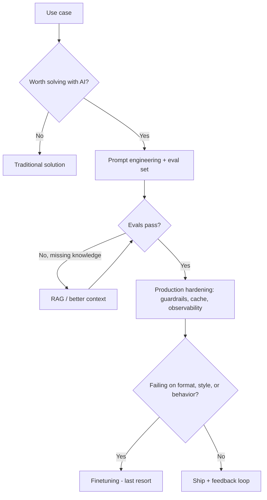

# AI Engineering

Distilled implementation guidance from *AI Engineering* (Chip Huyen, O'Reilly 2025), adapted to a LangChain/LangGraph/DeepAgents stack.
Full technique catalog: [REFERENCE.md](REFERENCE.md).
Reference chatbot skeleton: [EXAMPLES.md](EXAMPLES.md).

## 1. Model configuration

Never hardcode endpoints, keys, or model names in source code.
Read them from environment variables:

| Variable | Purpose |
|---|---|
| `LLM_BASE_URL` | OpenAI-compatible endpoint (for example a vLLM server) |
| `LLM_API_KEY` | API key, or a placeholder if the server ignores it |
| `LLM_MODEL` | Model name as served by the endpoint |

If these variables are not configured in the project (check `.env`, config files, secrets manager), ask the user for them before writing any client code.
Do not invent or guess an endpoint.

Use the OpenAI-compatible client:

```python
from langchain_openai import ChatOpenAI

llm = ChatOpenAI(base_url=..., api_key=..., model=...)
```

Self-hosted open models vary widely, so verify real capabilities before designing around them:

- Tool/function calling support (required before `bind_tools`)
- Structured output support (JSON mode, guided decoding)
- Actual served context length (not the model card number)
- Reasoning behavior (does it emit chain-of-thought tokens?)

A two-minute probe script against the endpoint beats assumptions.

## 2. Decision workflow



Rules of thumb:

- Always start with prompting; it is the cheapest iteration loop.
- Build the eval set alongside the first prompt, not after the demo works.
- Add RAG when failures come from missing knowledge, not from reasoning or format.
- Finetune only when prompting and RAG are maxed out and failures are about format, style, or behavior.
- Never finetune to fix a knowledge problem; finetuned knowledge goes stale.

## 3. Phase checklists

Apply the relevant checklist for the task at hand.
Details and pitfalls for each item live in [REFERENCE.md](REFERENCE.md).

### Prompting

- [ ] System prompt defines role, task, output format, and constraints
- [ ] Instructions are explicit; ambiguous wording is removed
- [ ] Few-shot examples cover typical and edge cases (example order affects output; test it)
- [ ] Complex tasks are split into subtasks or given time to think
- [ ] Outputs are structured (JSON schema or tool calling) when code consumes them
- [ ] Prompts are versioned like code

### Evaluation

- [ ] Eval set exists before scaling: real user inputs, edge cases, past failures
- [ ] Criteria are defined per app: factual consistency, instruction following, safety, cost, latency
- [ ] LLM-as-judge uses an explicit rubric, one criterion per judgment, validated against human labels
- [ ] Every component is evaluated, not just the final answer (retrieval quality, tool calls, guardrails)

### RAG

- [ ] Chunking strategy matches the data; fixed-size is not a default to apply blindly
- [ ] Hybrid retrieval (term-based + embedding) when keyword precision matters
- [ ] Reranking considered before stuffing more context
- [ ] Retrieved context tested for relevance; irrelevant context actively degrades answers

### Agents

- [ ] Tools are minimal and well-described with typed inputs; read-only first, write actions gated
- [ ] Known failure modes handled: bad plans, wrong tool, wrong parameters, loops, hallucinated calls
- [ ] Agent evaluated end-to-end and per-step; max steps and budget are capped
- [ ] Memory is scoped: what to store, for how long, how it is retrieved

### Production

- [ ] Input guardrails: prompt injection defenses, PII filtering, off-topic rejection
- [ ] Output guardrails: format validation, toxicity/PII checks, fallback responses
- [ ] Caching where possible: exact-match and semantic response caches
- [ ] Observability on: log prompts, completions, latency, token usage, tool calls
- [ ] User feedback mechanism exists and feeds the eval set

## 4. Stack conventions

| Tool | Use for |
|---|---|
| LangChain | Model I/O, retrieval components, integrations |
| LangGraph | Agents with explicit control flow: branching, loops, human-in-the-loop, persistence |
| DeepAgents | Long-horizon autonomous tasks: planning, subagents, filesystem access |

- Prefer LangGraph when each step must be controlled and auditable (most production chatbots).
- Prefer DeepAgents when the task is open-ended and multi-step (research, code modification).
- Keep provider-specific features behind the LangChain abstraction so the endpoint stays swappable.
