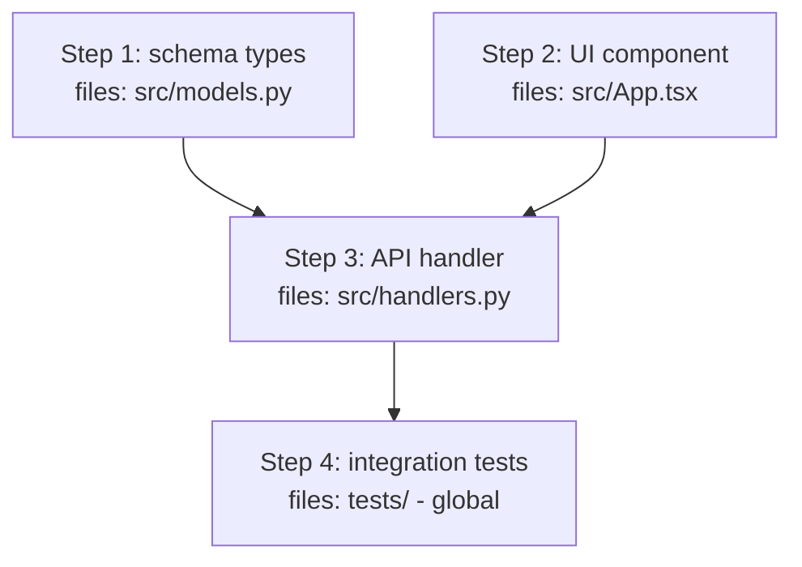

# Plan: <feature-slug>

<!-- Skeleton for docs/plan-<slug>.md.
Replace every <placeholder>.
Delete sections marked (conditional) when they do not apply.
Delete every HTML comment, including this one, from the final plan. -->

> Generated: <YYYY-MM-DD> | Base commit: <output of `git rev-parse --short HEAD`>

## Required skills

Files the executing agent must READ at session start.
List file paths, not skill names: some skills set `disable-model-invocation: true`, which blocks the Skill tool, so the agent must Read the files directly.

| Skill | Path | Why |
|-------|------|-----|
| <name> | .agents/skills/<name>/SKILL.md | <why the executor needs it> |

---

## Docs for Humans

<!-- Include Mermaid diagrams for structural/sequential concepts,
per the Diagrams section in PRD-TEMPLATE.md. -->

### Problem Statement

### Solution

### User Stories

1. As an <actor>, I want a <feature>, so that <benefit>

### Implementation Decisions

### Testing Decisions

### Out of Scope

### Further Notes

---

## Agent Instructions

> This section is for the agent executing the implementation.
> Read the skill files listed above before starting.

### Context to load first

- Skill files listed above
- Files to be modified (read before editing)
- Key types and interfaces
- Existing tests as style and pattern reference

**Do NOT:**

- Modify files outside those listed
- Refactor unrelated code
- Assume conventions that are not present in the codebase

### If an instruction cannot be executed as written

Detailed instructions are brittle, and the codebase may have moved past the plan's base commit (see header).
If a step cannot be executed exactly as written (file renamed, API changed, missing dependency):

1. Do NOT improvise an alternative silently.
2. If the mismatch is trivial (e.g. a slightly different file path), adapt, continue, and note it.
3. Otherwise stop, report the discrepancy, and ask how to proceed.

### Project commands

<!-- Author: verify these by running them against package.json, pyproject.toml, or Makefile, and fill in the project's actual commands.
Do not assume a stack: this repo has both a TypeScript frontend and a Python backend. -->

| Purpose | Command |
|---------|---------|
| Typecheck | <e.g. `make -C source typecheck` or `npx tsc --noEmit`> |
| Tests | <e.g. `make -C source test` or `npx vitest run`> |
| Lint | <e.g. `make -C source lint` or `npm run lint`> |
| Dev server (only if browser validation applies) | <e.g. `npm run dev`> |

### Execution strategy

| Strategy | Value |
|----------|-------|
| Mode | sequential | parallel |
| Max parallelism | <N workers, default 3> |
| Isolation | shared-branch | worktree-per-worker |

> If `Mode` is `sequential`, ignore the Waves table and use flat Implementation steps as today. If `parallel`, fill every section below; do not leave placeholders.

### Dependency graph

<!-- Required for parallel plans. Leaf nodes at top. Edges = depends_on. Mark file-conflict edges dashed. For sequential plans write: Not applicable - sequential plan. -->



### File conflict matrix

| File | Wave 1 | Wave 2 | Wave 3 | Conflict? |
|------|--------|--------|--------|-----------|
| <e.g. src/models.py> | Step 1 | - | - | No - isolated |
| <e.g. src/App.tsx> | Step 2 | - | - | No - isolated |
| <e.g. src/handlers.py> | - | Step 3 | - | - |

> No two parallel steps may touch the same file. If they do, sequentialize into sub-waves or split the file. Verify with `grep` on the Files column.

### Waves (only if parallel)

| Wave | Steps | Parallelizable | Depends on | Sub-agent assignment | Barrier guardrail |
|------|-------|----------------|------------|----------------------|-------------------|
| 1 | 1, 2 | yes (2 lanes) | - | `general` for Step 1, `explore` for Step 2 | `typecheck` both lanes green |
| 2 | 3 | no | Wave 1 | `general` | `tests` pass |
| 3 | 4 | yes (N lanes) | Wave 2 | `general x2` | `integration + lint` |

> Each lane is one `subagent` tool call with `background:true`. The coordinator waits at the barrier before starting the next wave. See Context to load per wave.

### Context to load per wave

<!-- Only for parallel plans. Each worker gets minimal context: its wave's files + key types + one example test. Shared context merges at barriers. For sequential plans write: Not applicable. -->

- Wave 1 Lane A (Step 1): `<files>`, `<key types>`, `<example test>`
- Wave 1 Lane B (Step 2): `<files>`, `<key types>`, `<example test>`
- Shared after Wave 1 barrier: `<integration tests, shared types>`

### Implementation steps

Each step has a **guardrail**: a verifiable condition that must hold before moving to the next step.
If a guardrail fails, stop and report.
For parallel plans, `Waves` defines which steps run concurrently and each lane's `subagent` assignment; lane failures isolate until the barrier (see Error budget). For sequential plans, steps are flat and `Waves` is `Not applicable`.

<!-- Example row (delete):
| 1 | Add `carpeta_id` to the Ticket model | source/app/models.py | `make -C source typecheck` reports no new errors |
-->

| # | Step | Files | Guardrail |
|---|------|-------|-----------|
| 1 | <short description> | <files to touch> | <verifiable condition> |
| 2 | ... | ... | ... |

### Evals (Evaluation-Driven Development)

Define the eval before implementing the step.
Each step has one or more evals proving the change works.
For parallel plans, each eval runs after its wave's barrier unless it is lane-local (typecheck per lane).

<!-- Example row (delete):
| 1 | A ticket saved with a carpeta_id reads back with the same carpeta_id | integration | `make -C source test` |
-->

| Step | Eval | Type | Command | Run after |
|------|------|------|---------|-----------|
| 1 | <test description> | unit / integration / e2e | <command> | Wave 1 barrier | 
| 2 | ... | ... | ... | Wave 1 barrier or lane-local |

> For sequential plans, `Run after` is `Step N` or `global`. Lane-local evals (e.g. `typecheck` per lane) may run before the barrier.

### Browser validation (conditional: only if the change affects UI)

Use the agent's Playwright MCP browser tools: `browser_navigate`, `browser_snapshot`, `browser_click`, `browser_take_screenshot`.
Do NOT use `@playwright/test`.
If the MCP browser tools are not available in the session, report it and skip this section - do not substitute another mechanism.

1. Start the dev server
2. Navigate to the relevant page with `browser_navigate`
3. Check that the expected elements exist with `browser_snapshot`
4. Interact with `browser_click` if applicable
5. Capture evidence with `browser_take_screenshot`

Success criterion:

```
<what the snapshot must show>
```

### Human-in-the-Loop checkpoints

At these points the agent must PAUSE and ask the user before continuing.
Keep it to 1-3 checkpoints: each one interrupts the executor's autonomous flow.
For parallel plans, use wave barriers as checkpoints.

1. **After step <N>:** <what the user must confirm>
2. **After Wave <N> barrier (only if parallel):** <all lanes in wave done, confirm merge or next wave>
3. **Before merge:** <final validation>

### Error budget

Single source of truth for failure tolerance in this plan.
For parallel plans, `Scope` distinguishes per-wave isolation from global fail-fast.

| Event | Scope | Limit | Action when exceeded |
|-------|-------|-------|----------------------|
| New or failing test | per-wave (parallel) / global (sequential) | 2 fix attempts | For per-wave: isolate lane, others continue to barrier, coordinator decides; for global: stop and report; never continue or declare done with failing tests |
| Type errors in touched files | per-wave / global | 0 | Isolate lane until barrier, then stop and fix before next wave |
| Pre-existing type errors | global | Not counted | Ignore, they predate the change |
| New lint errors | per-wave / global | 0 | Isolate lane; stop and fix before next wave |
| Browser validation failure | global | 1 retry | Stop, report, and ask |
| File not found | per-wave / global | - | If a trivial rename, adapt and note it; otherwise stop and report |
| Ambiguous instruction | global | 0 | Stop and ask; never assume |

### Completion checklist

The agent must complete this before declaring the work done:

- [ ] All implementation steps done (all waves and barriers green for parallel plans)
- [ ] New tests pass
- [ ] Existing tests still pass
- [ ] Typecheck passes with no new errors
- [ ] Lint passes
- [ ] Browser validation passed (only if applicable)
- [ ] No out-of-scope files modified
- [ ] Dependency graph and file-conflict matrix filled (or `Not applicable` for sequential)

---

## Risks

| Risk | Mitigation |
|------|-----------|
| <risk> | <mitigation> |
