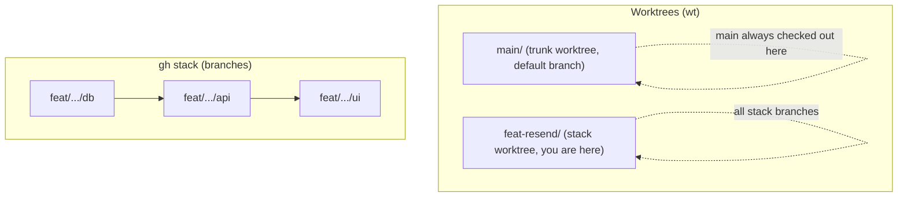

# wt-stacked-prs: Worktrunk Worktrees + Stacked PRs

## Where you are standing

- You are inside a **git worktree**, not a normal single-checkout repo.
- This project is a bare repo + worktrees setup: `/Users/esau.martinez/Code/facium/` contains `.bare/` (git metadata), `main/` (trunk worktree) and one folder per active branch (e.g. `feat-resend/`). Before `wt` bare conversion, `/Users/esau.martinez/Code/facium` itself is the trunk checkout on `main`.
- **A trunk worktree for the default branch already exists**: `/Users/esau.martinez/Code/facium` (or `/Users/esau.martinez/Code/facium/main` after bare conversion) on branch `main`.
- The current worktree already has a **`gh stack` registered**; stack state lives in the shared git dir (`.bare/gh-stack` or `.git/gh-stack` before conversion).
- `main` is checked out in its own worktree, so **never** try to `git checkout main`, `git switch main` or `git pull` from the current worktree when in worktree mode.
- Git will reject those with `fatal: 'main' is already used by worktree` / `cannot force update the branch 'main' used by worktree`. That is expected by design, not something to fix.

## How to work

- One task = one worktree = one branch.
- Create **small changes as a stack of small PRs** (`gh stack`), never one big PR.
- The base branch for PRs is `main`; feature branches are named `feat/...`, `fix/...`, `chore/...`.
- Use conventional commits (`feat:`, `fix:`, `chore:`, `docs:`).
- `gh stack init <branch>` registers the stack; `gh stack add <branch>` adds a dependent branch (the checkout happens inside the same worktree).
- `gh stack submit --auto --open` creates the PR chain ready for review.
- During development `gh stack sync` is safe, but `gh stack trunk` and trunk navigation fail with worktrees; do not use them.

## Closing the cycle (after the stack PRs are merged)

1. Run `gh stack sync --prune` (you or the user).
2. It prints warnings. **They are expected and by design. Do not panic, do not try to "fix" them, and do not attempt the git commands they suggest.**
3. The expected warnings look like this:

```
⚠ Could not update local main: failed to run git: fatal: cannot force update the branch 'main' used by worktree at '/Users/esau.martinez/Code/facium'
  Rebasing the stack onto origin/main instead; local main is unchanged.
⚠ Failed to switch from feat/sentry to main: failed to run git: fatal: 'main' is already used by worktree at '/Users/esau.martinez/Code/facium'
⚠ Failed to delete feat/sentry: failed to run git: error: cannot delete branch 'feat/sentry' used by worktree at '/Users/esau.martinez/Code/facium/feat-sentry'
```

4. What each warning means:
   - `cannot force update the branch 'main' used by worktree` -> normal; gh stack rebases onto `origin/main` instead and local `main` is left untouched.
   - `Failed to switch from <branch> to main` -> normal; `main` lives in its own trunk worktree, the stack worktree stays on the last stack branch on purpose.
   - `Failed to delete <branch>` -> normal; the last stack branch is checked out in the current worktree, so only git can delete it via the worktree.
5. All merged branches are pruned automatically; only the branch checked out in the current worktree survives.
6. **Notify the user** to run `wtr` (wt remove) in the current worktree. Do NOT try to remove the worktree or delete the branch yourself.
7. After the user runs `wtr`, the shell lands in the trunk worktree (`main`). Then run `git fetch` and `git pull` from the default branch worktree to bring in the merged changes.

## Command reference

| Operation | Command |
| --- | --- |
| Create branch + worktree | `wts -c <branch>` |
| Switch to an existing worktree | `wts <branch>` |
| List worktrees | `wtl` |
| Remove current worktree | `wtr` (`wtr -f` if there are uncommitted changes) |
| Register the stack | `gh stack init <branch>` |
| Add a branch to the stack | `gh stack add <branch>` |
| Create the PR chain | `gh stack submit --auto --open` |
| Sync during development | `gh stack sync` |
| Clean merged branches after merge | `gh stack sync --prune` |

## Layout


