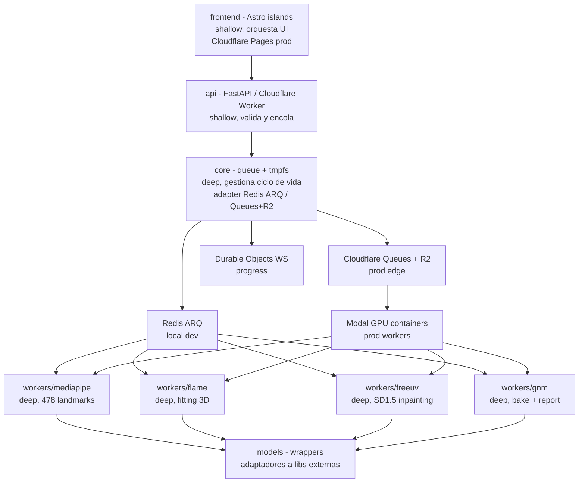
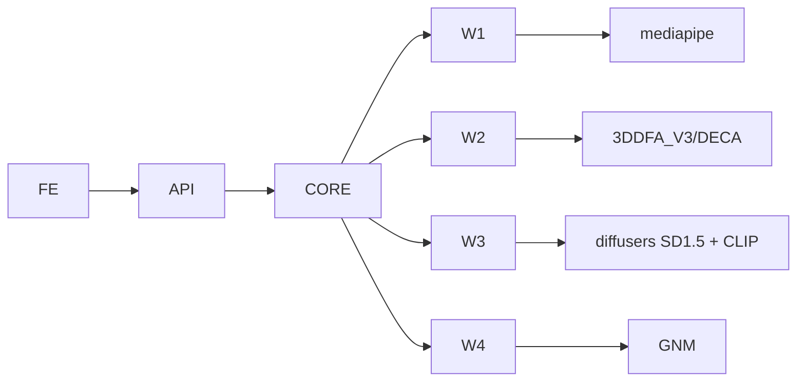

# ARCHITECTURE - Vultus

## 1. Objetivo

Este documento describe la forma del sistema, no el flujo.
Explica módulos, seams y decisiones de diseño.
Usa vocabulario de `codebase-design` para seams y profundidad.

## 2. Principios

Stateless por defecto.
No hay persistencia más allá de 60s (local: Redis `EXPIRE 60`; prod: R2 `lifecycle 60s` + Queues `retención 24h` pero `TTL lógico 60s`).
Async por queue, no por threads en API.
Deep modules con interfaces estrechas y lógica profunda dentro.
Infra: `Cloudflare Pages + Workers + Queues + R2 + Durable Objects` para edge + `Modal` para GPU (ver ADR-004).

## 3. Seams

Seam es la frontera pública donde se testean comportamientos sin mirar internos.

### Seam 1 - HTTP API

`POST /v1/compare`, `GET /v1/jobs/{id}`, `WS /v1/jobs/{id}/events`, `GET /health`.
Es la única entrada para el cliente Astro.
Testeable con `httpx.AsyncClient` real sin mocks.
Contrato OpenAPI en `backend/app/api`.

### Seam 2 - Queue Contract

`enqueue(job_id, image_a, image_b)` y `consume -> progress`.
Contrato abstracto; implementación dual vía adapter `core.queue`:
- **Local/dev/test:** `Redis + ARQ` (con `fakeredis` en tests).
- **Prod:** `Cloudflare Queues + R2` (Queues limita a 128KB/mensaje, se encola solo `{job_id, r2_keys}` y los bytes viven en R2; consumo vía `HTTP Pull Consumer` desde Modal).
Testeable con `fakeredis` o Redis de test en Docker sin tocar Cloudflare.
No se testea Redis ni Queues interno.

### Seam 3 - Worker Contract

`image bytes -> {uv_a, uv_b, heatmap, mesh, report}`.
Cada worker es caja negra.
Input imagen golden, output bytes verificables.
No se mockean `MediaPipe` ni `FreeUV` entre sí.

No son seams: `fit_flame`, `bake_bfm_to_gnm`, `project_uv`, `compute_heatmap`.
Se cubren indirectamente vía Seam 3.

## 4. Módulos

### 4.1 api

Módulo shallow.
Valida `multipart`, magic bytes y tamaño.
Genera `job_id` y encola.
Expone `StreamingResponse` y `WS`.
No contiene lógica de visión.

### 4.2 core

Módulo deep.
Gestiona pool de queue, `TTL 60`, `tmpfs` lifecycle y `progress` events.
Esconde detalles de `Redis ARQ` (local) y `Cloudflare Queues + R2 + Durable Objects` (prod) tras el mismo adapter.
Patrón `R2 pointer`: en prod sube bytes a `R2` y encola solo `r2_keys` (Queues <128KB).
Provee `core.queue.enqueue` y `core.queue.result` agnósticos a la infra.

### 4.3 workers

Cada worker es módulo deep con una sola responsabilidad.
Recibe bytes, escribe a `/tmp/{job_id}` en tmpfs, retorna bytes.
No conocen HTTP ni frontend.

### 4.4 models

Adaptadores a librerías externas.
`models.mediapipe`, `models.flame`, `models.freeuv`, `models.gnm`.
Aíslan cambios de API de terceros.
Son los únicos lugares donde se importan `mediapipe`, `torch`, `diffusers`.

### 4.5 frontend

Astro 4 con React islands desplegado en `Cloudflare Pages` en prod (static, free, global CDN).
Islas: `UploadDrop`, `ProgressBar`, `UVViewer`, `HeatmapViewer`, `ThreeViewer`.
Comunicación solo vía Seam 1 (en prod `Pages -> Workers` via `wrangler.toml` routing).

## 5. Dependencias

Dirección siempre hacia adentro.
Ningún `models` importa `api` o `core`.
Esto permite testear `workers` sin levantar `FastAPI`.

## 6. Decisiones

### ADR-001 ARQ sobre Celery

ARQ es nativo asyncio y no requiere `billiard` ni `kombu`.
Menor footprint y mejor integración con `FastAPI`.
Celery es más maduro pero más pesado para un pipeline corto con TTL.

### ADR-002 FLAME para extracción, GNM para render

FLAME ya tiene fitting y FreeUV entrenado en BFM.
GNM no trae encoder imagen a params.
Usar FLAME para extraer `flaw-uv` y GNM solo para render vía bake evita reentrenar FreeUV.

### ADR-003 Stateless sin Postgres ni S3

Elimina coste de storage y simplifica GDPR.
Local: Redis con `EXPIRE 60` y tmpfs es suficiente para entregar zip en memoria.
Prod: R2 con `lifecycle 60s` + Queues `retención 24h` pero TTL lógico 60s vía Durable Object alarm.
Se pierde cache y re-descarga desde servidor, pero se gana privacidad y simplicidad.

### ADR-004 Cloudflare + Modal como infra elegida

**Decisión:** Edge en `Cloudflare Pages + Workers + Queues + R2 + Durable Objects + Turnstile/WAF` y GPU en `Modal` via `HTTP Pull Consumer`.

**Contexto:** Roadmap barajaba `Vercel + Fly.io + Upstash Redis` ($25-60/mes fijos + GPU) y `GCP`. Se buscaba capa gratuita real con `scale-to-zero` y `egress free`, manteniendo fidelidad forense (FreeUV 12GB VRAM).

**Alternativas descartadas:**
- `Vercel + Fly + Upstash`: $25-60 fijos, egress con coste, Redis gestionado extra.
- `HF Spaces`: requiere PRO $9/mes para Docker, sleep 48h, cold start 30-60s, no apto para TTL 60s.
- `100% Cloudflare Workers AI`: `flux-1-schnell` no es FreeUV entrenado en BFM UV, 10k neurons/día ~25 compares, pérdida de fidelidad forense.
- `GCP Cloud Run GPU`: 80-200 usd/mes, sin free tier GPU.

**Consecuencias:**
- Coste fijo prod: `Cloudflare Workers Paid $5/mes` + `Modal $30/mes free` (~9.300 compares gratis), luego `$0.0032/compare` T4. Queues (`10k ops/día free`), R2 (`10GB free`), Pages free.
- Queue debe usar patrón `R2 pointer` por límite `128KB` de Queues; `core.queue` abstrae `Redis ARQ` local vs `Queues+R2` prod.
- Workers GPU despliegan con `modal deploy` y consumen Queues vía `HTTP Pull Consumer` (no binding Worker).
- `wrangler.toml` versiona edge, `modal_app.py` versiona GPU. Paridad local intacta con `docker compose` + Redis.

## 7. Data Flow

Imagen entra como `bytes` y nunca toca disco persistente más allá de `tmpfs`/`R2 60s`.
Prod: `Browser -> R2 PutObject (via Worker presigned) -> Queues {job_id, r2_keys} -> Modal workers leen R2 -> /tmp tmpfs -> R2 result.zip -> Worker StreamingResponse`.
Local: `Browser -> FastAPI -> Redis ARQ bytes -> workers -> /tmp -> Redis bytes -> StreamingResponse`.
El bundle final viaja `worker -> R2/Rredis bytes -> API/Worker -> StreamingResponse`.
Ningún artefacto se guarda en S3/Postgres persistente. `R2 lifecycle 60s` garantiza olvido.

## 8. Escalado

Local: `worker-cpu` y `worker-gpu` escalan independiente vía `docker compose --scale`.
Prod: `Cloudflare Workers` autoescala edge a 0, `Modal` autoescala GPU `0 -> 100` con `10 GPU concurrency` en Starter free y `50` en Team, `1-2s` cold start.
`FreeUV` es cuello de botella y debe tener `concurrency=1` por GPU para no OOM.
`MediaPipe` puede tener `concurrency=4` en CPU.
R2 y Queues escalan sin gestión (queues `10k ops/día free`, luego `$0.40/M ops`).

## 9. Observabilidad

`core` emite `duration_ms` por etapa y `vram_mb`.
`GET /health` verifica `queue ping` (Redis `PING` local / Queues health en prod) y `torch.cuda.is_available` en Modal.
En prod: `Cloudflare Analytics + Workers Logs` (3 días free), `Durable Objects` para progress, `Modal logs` para GPU.
Logs con `job_id` sin bytes.
Métricas expuestas para `OpenTelemetry`.

## 10. Testing

Seam 1 con `httpx` real.
Seam 2 con `fakeredis`.
Seam 3 con golden images y `assert sha256(uv) == GOLDEN_HASH`.
Nada de unit tests a `fit_flame` interno.
Ver `CONTEXT.md` y `PIPELINE.md` para contratos.
