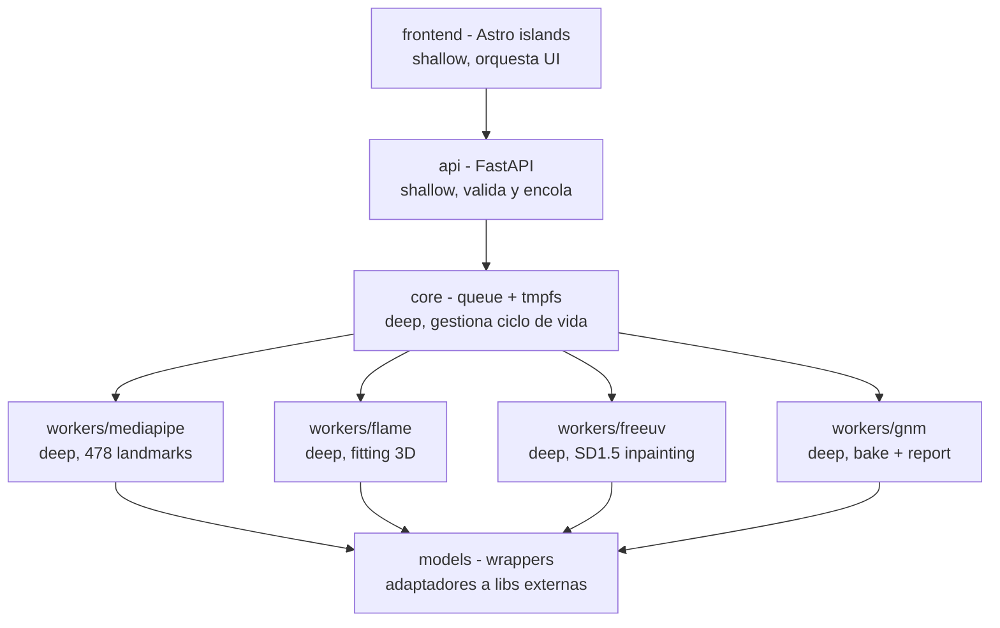
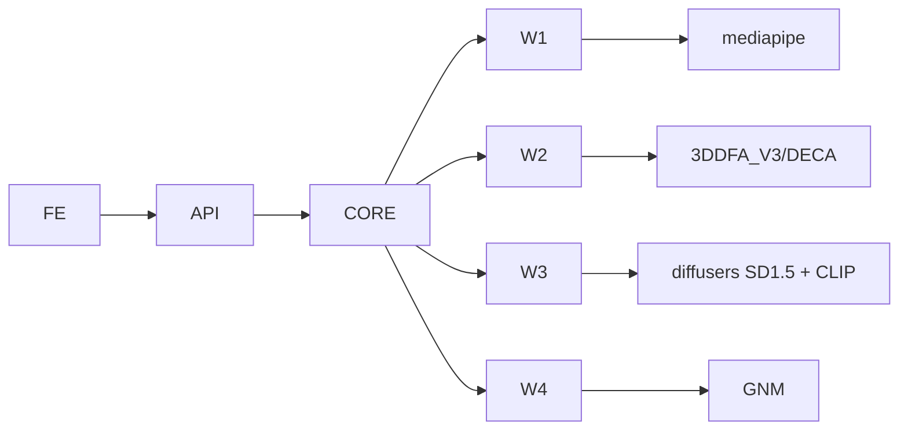

# ARCHITECTURE - Vultus

## 1. Objetivo

Este documento describe la forma del sistema, no el flujo.
Explica módulos, seams y decisiones de diseño.
Usa vocabulario de `codebase-design` para seams y profundidad.

## 2. Principios

Stateless por defecto.
No hay persistencia más allá de 60s en Redis.
Async por queue, no por threads en API.
Deep modules con interfaces estrechas y lógica profunda dentro.

## 3. Seams

Seam es la frontera pública donde se testean comportamientos sin mirar internos.

### Seam 1 - HTTP API

`POST /v1/compare`, `GET /v1/jobs/{id}`, `WS /v1/jobs/{id}/events`, `GET /health`.
Es la única entrada para el cliente Astro.
Testeable con `httpx.AsyncClient` real sin mocks.
Contrato OpenAPI en `backend/app/api`.

### Seam 2 - Queue Contract

`enqueue(job_id, image_a, image_b)` y `consume -> progress`.
Implementación `Redis + ARQ`.
Testeable con `fakeredis` o Redis de test en Docker.
No se testea Redis interno.

### Seam 3 - Worker Contract

`image bytes -> {uv_a, uv_b, heatmap, mesh, report}`.
Cada worker es caja negra.
Input imagen golden, output bytes verificables.
No se mockean `MediaPipe` ni `FreeUV` entre sí.

No son seams: `fit_flame`, `bake_bfm_to_gnm`, `project_uv`, `compute_heatmap`.
Se cubren indirectamente vía Seam 3.

## 4. Módulos

### 4.1 api

Módulo shallow.
Valida `multipart`, magic bytes y tamaño.
Genera `job_id` y encola.
Expone `StreamingResponse` y `WS`.
No contiene lógica de visión.

### 4.2 core

Módulo deep.
Gestiona `ARQ` pool, `TTL 60`, `tmpfs` lifecycle y `progress` events.
Esconde detalles de Redis al resto.
Provee `core.queue.enqueue` y `core.queue.result`.

### 4.3 workers

Cada worker es módulo deep con una sola responsabilidad.
Recibe bytes, escribe a `/tmp/{job_id}` en tmpfs, retorna bytes.
No conocen HTTP ni frontend.

### 4.4 models

Adaptadores a librerías externas.
`models.mediapipe`, `models.flame`, `models.freeuv`, `models.gnm`.
Aíslan cambios de API de terceros.
Son los únicos lugares donde se importan `mediapipe`, `torch`, `diffusers`.

### 4.5 frontend

Astro 4 con React islands.
Islas: `UploadDrop`, `ProgressBar`, `UVViewer`, `HeatmapViewer`, `ThreeViewer`.
Comunicación solo vía Seam 1.

## 5. Dependencias

Dirección siempre hacia adentro.
Ningún `models` importa `api` o `core`.
Esto permite testear `workers` sin levantar `FastAPI`.

## 6. Decisiones

### ADR-001 ARQ sobre Celery

ARQ es nativo asyncio y no requiere `billiard` ni `kombu`.
Menor footprint y mejor integración con `FastAPI`.
Celery es más maduro pero más pesado para un pipeline corto con TTL.

### ADR-002 FLAME para extracción, GNM para render

FLAME ya tiene fitting y FreeUV entrenado en BFM.
GNM no trae encoder imagen a params.
Usar FLAME para extraer `flaw-uv` y GNM solo para render vía bake evita reentrenar FreeUV.

### ADR-003 Stateless sin Postgres ni S3

Elimina coste de storage y simplifica GDPR.
Redis con `EXPIRE 60` y tmpfs es suficiente para entregar zip en memoria.
Se pierde cache y re-descarga desde servidor, pero se gana privacidad y simplicidad.

## 7. Data Flow

Imagen entra como `bytes` y nunca toca disco persistente.
Cada worker lee de `/tmp` tmpfs y escribe siguiente artefacto a `/tmp`.
El bundle final viaja `worker -> Redis bytes -> API -> StreamingResponse`.
Ningún artefacto se guarda en S3.

## 8. Escalado

`worker-cpu` y `worker-gpu` escalan independiente vía `docker compose --scale`.
`FreeUV` es cuello de botella y debe tener `concurrency=1` por GPU para no OOM.
`MediaPipe` puede tener `concurrency=4` en CPU.

## 9. Observabilidad

`core` emite `duration_ms` por etapa y `vram_mb`.
`GET /health` verifica `redis ping` y `torch.cuda.is_available`.
Logs con `job_id` sin bytes.
Métricas expuestas para `OpenTelemetry`.

## 10. Testing

Seam 1 con `httpx` real.
Seam 2 con `fakeredis`.
Seam 3 con golden images y `assert sha256(uv) == GOLDEN_HASH`.
Nada de unit tests a `fit_flame` interno.
Ver `CONTEXT.md` y `PIPELINE.md` para contratos.
