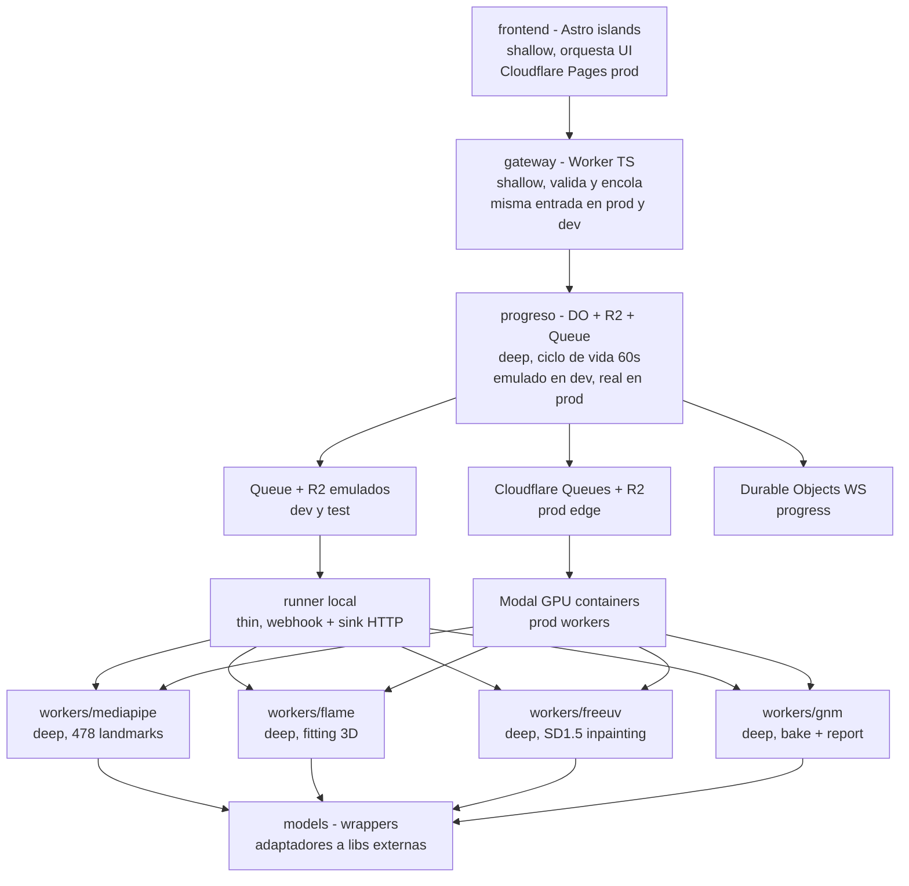
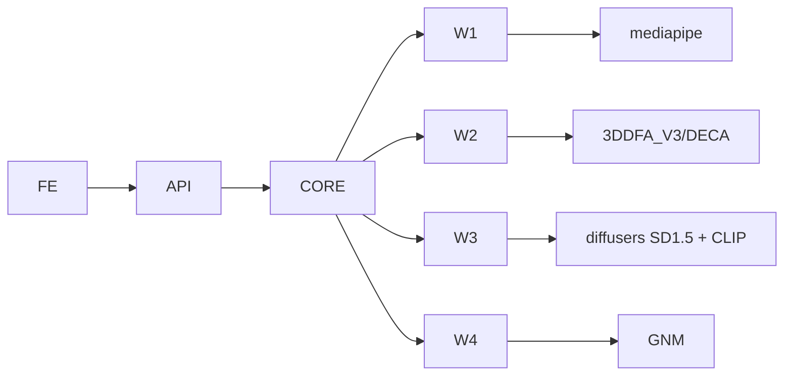

# ARCHITECTURE - Vultus

> Estado objetivo sin Rust ni API Python (plan-single-gateway-ts): un solo dueno por seam.
> TypeScript es fuente de verdad del contrato HTTP y dueno del gateway (`edge/worker.ts`, entrada dev `edge/worker.dev.ts`).
> Python es dueno del runner local (`backend/local_runner.py`), el orquestador (`backend/pipeline_local.py`) y el bake CPU (`backend/gnm.py`).
> Comandos nuevos: `pip install -r backend/requirements-api.txt`, `mypy --strict backend/domain.py backend/gnm.py backend/pipeline_local.py backend/local_runner.py`,
> `pytest backend/tests -q`, `npx vitest run edge/contract.test.ts`, pool suite `npx vitest run --config vitest.pool.config.ts` (desde `frontend/`).

## 1. Objetivo

Este documento describe la forma del sistema, no el flujo.
Explica módulos, seams y decisiones de diseño.
Usa vocabulario de `codebase-design` para seams y profundidad.

## 2. Principios

Stateless por defecto.
No hay persistencia más allá de 60s (local: DO TTL 60s + purga a 2xTTL con R2/Queue emulados; prod: R2 `lifecycle 60s` + Queues `retención 24h` pero `TTL lógico 60s`).
Async por queue, no por threads en el gateway.
Deep modules con interfaces estrechas y lógica profunda dentro.
Infra: `Cloudflare Pages + Workers + Queues + R2 + Durable Objects` para edge + `Modal` para GPU (ver ADR-004).

## 3. Seams

Seam es la frontera pública donde se testean comportamientos sin mirar internos.

### Seam 1 - HTTP API

`POST /v1/compare`, `GET /v1/jobs/{id}`, `WS /v1/jobs/{id}/events`, `GET /health`.
Es la única entrada para el cliente Astro.
Testeable con suite pool en runtime real sin mocks (6 tests: 202 + `status queued`, `GET` queued, 400 imagen / faltante / uuid, 404 desconocido, 409 pre-done, `health` con `gateway:"worker"`, expiración `expired`) mas WS real (snapshot `queued`, handshake falla en desconocido) y negativo del backdoor dev (`404` con vars prod).
Respuestas tipadas `CompareResponse` / `JobResponse` y errores `-> {400,404,500}` con cuerpo `{"detail":...}`.
Contrato en `edge/contract.ts` (fuente única) con gateway en `edge/worker.ts` y entrada dev en `edge/worker.dev.ts`.

### Seam 2 - Progress Sink

`report(Progress, Stage)`, `complete(CompareResult)`, `fail()`.
Contrato estrecho entre pipeline y progreso, misma forma en local y prod:
- **Local/dev/test:** `HttpProgressSink` en el runner (`POST /progress`, `PUT /dev/results`) e `InMemorySink` en tests.
- **Prod:** los workers GPU reportan al mismo seam HTTP y escriben `result.zip` a R2.
Testeable con el sink en memoria sin tocar Cloudflare.
No se testea Queues/R2 interno de Cloudflare.

### Seam 3 - Worker Contract

`&ImageBytes -> Landmarks (478 JSON) -> FlawUv (UV_LEN) -> CompleteUv (UV_LEN) -> Heatmap (UV_LEN)` vía `MlSidecarClient { landmarks, flame, freeuv }` + `BaseUrl` + `FlamePayload (u32 BE len + landmarks_json + image_bytes)`.
Cada worker es caja negra.
Input imagen golden (`ImageBytes::parse`), output `UV_LEN = 512x512x3 = 786432` verificable.
No se mockean `MediaPipe` ni `FreeUV` entre sí.

No son seams: `fit_flame`, `bake_bfm_to_gnm`, `project_uv`, `compute_heatmap`.
Se cubren indirectamente vía Seam 3.

## 4. Módulos

### 4.1 gateway

Módulo shallow en TypeScript (`edge/worker.ts` en prod, `edge/worker.dev.ts` en dev).
Valida `multipart`, magic bytes y tamaño vía el contrato y encola solo `{job_id, r2_keys}`.
La entrada dev agrega exactamente dos rutas (`GET /dev/blobs`, `PUT /dev/results`, solo con `ALLOW_DEV_ROUTES=1`) y el consumer dev hacia el webhook del runner.
Errores mapean a `400` (validación), `404` (`NotFound`), `500` (bindings) con cuerpo `{"detail":...}`.
Expone `CompareResponse{job_id, status:"queued"}` (`202`), `JobResponse{job_id, status}` (`200`), `GET /health` con `gateway:"worker"` y `WS`.
No contiene lógica de visión.

### 4.2 progreso y cómputo

Módulo deep en edge (`ProgressDO` + R2 + Queue).
Gestiona ciclo `queued->processing->done|failed|expired`, `TTL 60`, ventana `expired` visible y purga a 2xTTL.
Tipos del contrato (`JobId`, `TtlSecs`, `Progress`, `Stage`, `JobStatus`) con smart constructors que retornan `Result`; el pipeline recibe tipos ya probados.
Patrón `R2 pointer`: el worker sube bytes a `R2` y encola solo `r2_keys` (Queues <128KB).
El runner local (`backend/local_runner.py`, thin, solo stdlib) implementa el sink sobre HTTP; los tests lo implementan en memoria.
Deps compute local: `httpx/Pillow/numpy` (ver `backend/requirements-api.txt`).

### 4.3 workers

Cada worker es módulo deep con una sola responsabilidad.
`Worker 1/2/3 ML` viven en sidecar Python Modal tras `POST /ml/landmarks|flame|freeuv` consumido por `MlSidecarClient` con firmas tipadas (`-> Landmarks`, `-> FlawUv`, `-> CompleteUv`).
`Worker 4 CPU` (`bake`, `heatmap`, `report`) vive en `backend/gnm.py` con firmas `compute_heatmap` y `bake_bfm_to_gnm` (sin dep `torch/diffusers/mediapipe`).
Reciben tipos ya probados, escriben a `/tmp/{job_id}` en tmpfs, retornan tipos con `UV_LEN`.
No conocen HTTP ni frontend.

### 4.4 models

Adaptadores a librerías externas.
Python: sidecar `backend/modal_app.py` (`/ml/landmarks|flame|freeuv`) y bake CPU `backend/gnm.py` (`compute_heatmap`, `bake_bfm_to_gnm`, `build_result_zip`).
Son los únicos lugares donde viven esas dependencias.

### 4.5 frontend

Astro 4 con React islands desplegado en `Cloudflare Pages` en prod (static, free, global CDN).
Islas: `UploadDrop`, `ProgressBar`, `UVViewer`, `HeatmapViewer`, `ThreeViewer`.
Comunicación solo vía Seam 1 (en prod `Pages -> Workers` via `wrangler.toml` routing).

## 5. Dependencias

Dirección siempre hacia adentro.
Ningún `models` importa `api` o `core`.
Esto permite testear `workers` sin levantar `FastAPI`.

## 6. Decisiones

### ADR-001 ARQ sobre Celery (histórico, superado por ADR-005)

ARQ era nativo asyncio y no requería `billiard` ni `kombu`.
Al mover la API a Rust, `ARQ` (Python-only) dejó de aplicar.
El contrato actual es trait `Queue` con `MemoryQueue` / `R2PointerQueue` + `Store`, sin Redis ni Celery en código.
Se conserva por contexto, no como decisión vigente.

### ADR-002 FLAME para extracción, GNM para render

FLAME ya tiene fitting y FreeUV entrenado en BFM.
GNM no trae encoder imagen a params.
Usar FLAME para extraer `flaw-uv` y GNM solo para render vía bake evita reentrenar FreeUV.

### ADR-003 Stateless sin Postgres ni S3

Elimina coste de storage y simplifica GDPR.
Local: `Store` con `TTL 60` + reaper a 2xTTL y tmpfs es suficiente para el job dummy en memoria (sin `Redis`).
Prod: R2 con `lifecycle 60s` + Queues `retención 24h` pero TTL lógico 60s vía Durable Object alarm.
Se pierde cache y re-descarga desde servidor, pero se gana privacidad y simplicidad.

### ADR-004 Cloudflare + Modal como infra elegida

**Decisión:** Edge en `Cloudflare Pages + Workers + Queues + R2 + Durable Objects + Turnstile/WAF` y GPU en `Modal` via `HTTP Pull Consumer`.

**Contexto:** Roadmap barajaba `Vercel + Fly.io + Upstash Redis` ($25-60/mes fijos + GPU) y `GCP`. Se buscaba capa gratuita real con `scale-to-zero` y `egress free`, manteniendo fidelidad forense (FreeUV 12GB VRAM).

**Alternativas descartadas:**
- `Vercel + Fly + Upstash`: $25-60 fijos, egress con coste, Redis gestionado extra.
- `HF Spaces`: requiere PRO $9/mes para Docker, sleep 48h, cold start 30-60s, no apto para TTL 60s.
- `100% Cloudflare Workers AI`: `flux-1-schnell` no es FreeUV entrenado en BFM UV, 10k neurons/día ~25 compares, pérdida de fidelidad forense.
- `GCP Cloud Run GPU`: 80-200 usd/mes, sin free tier GPU.

**Consecuencias:**
- Coste fijo prod: `Cloudflare Workers Paid $5/mes` + `Modal $30/mes free` (~9.300 compares gratis), luego `$0.0032/compare` T4. Queues (`10k ops/día free`), R2 (`10GB free`), Pages free.
- Queue debe usar patrón `R2 pointer` por límite `128KB` de Queues; `core.queue` abstrae `MemoryQueue` local vs `Queues+R2` prod (sin `Redis`).
- Workers GPU despliegan con `modal deploy` y consumen Queues vía `HTTP Pull Consumer` (no binding Worker).
- `wrangler.toml` versiona edge, `modal_app.py` versiona GPU. Paridad local intacta con `docker compose` + `Store` en memoria (sin `Redis`).

### ADR-005 Híbrido Rust + Python sidecar ML (supera a ADR-001 en API)

**Decisión (histórico Rust, superado):** antes `Seam 1 API + Seam 2 queue + Worker 4 CPU` en Rust (`Axum + tokio`, `backend/crates/`, borrado). Hoy Python es dueno (`backend/app.py`, `backend/store.py`, `backend/gnm.py`) y `Worker 1/2/3 ML GPU` siguen en Python (`backend/modal_app.py`) tras `POST /ml/landmarks|flame|freeuv`.

**Contexto:** ADR-001 elegía `ARQ` por ser asyncio nativo. Al mover la API a Rust, `ARQ` (Python-only) y `Modal SDK` (Python-only) no son portables. Reescribir `MediaPipe/FLAME/FreeUV` a `ort/candle/burn` costaría meses y rompería fidelidad forense (golden `sha256(uv)`).

**Consecuencias:**
- Rust nunca importa `torch/diffusers/mediapipe`. Frontera: tipos probados por HTTP + `X-Job-Id` vía `BaseUrl::join` y `FlamePayload`.
- `gnm_bake_worker` Python queda deprecated (`NotImplementedError`); `compute_heatmap(&CompleteUv, &CompleteUv) -> Heatmap` + `bake_bfm_to_gnm(&FlawUv) -> CompleteUv` viven en `vultus-workers-cpu` (infallibles, tests `black_heatmap` con `UV_LEN`) sin dep `image`.
- `wrangler.toml` sin `python_workers`; edge es gateway fino, API pesada en Rust.
- `Dockerfile` compila binario Rust; `Dockerfile.gpu` solo sidecar Python.

### ADR-006 Parse-don-t-validate con tipos probados + goldens

**Decisión:** Dominio con tipos probados que prueban en `parse` (`ImageBytes`, `JobId` trim, `R2Key`, `Landmarks` 478 JSON, `FlawUv` / `CompleteUv` / `Heatmap` con `UV_LEN`, `BaseUrl`, `TtlSecs`) y ciclo con estados separados.
Errores taxonómicos `CoreError` (+ `ImageError`, `BaseUrlError`, `MlError`, `QueueError`) con mapeo fijo `AppError -> 400|404|500`.
Goldens literales a mano (`Progress`, `TtlSecs`, `R2Key`, heatmap `[6,10]`, bake `[10,176,7]`), relojes manuales sin sleeps.

**Contexto:** El diff mostraba `Vec<u8>` y `&str` sueltos cruzando seams (`enqueue(a,b)`, `stage: &str`, `job.status String`, `base_url String`).
Eso permitía `..` en R2, `UV` de largo wrong y `stage` typo en compilación.

**Consecuencias:**
- `Queue` recibe `EnqueueCommand`, no bytes sueltos; `set_progress` exige `Stage`, no `&str`.
- `EnqueuedJob` / `R2Keys` con campos privados y `is_r2_pointer()`.
- `MlSidecarClient` devuelve `Landmarks` / `FlawUv` / `CompleteUv`, no `Vec<u8>`.
- `workers_cpu` es infallible porque la prueba ya ocurrió en el borde.

### ADR-007 Edge GET lee Durable Object (no dummy)

**Decisión:** `GET /v1/jobs/{id}` en edge lee el `ProgressDO` (`GET /status`) como fuente de verdad. Dummy `queued` solo como fallback si el binding DO falta en `wrangler dev`.

**Contexto:** El gateway devolvía `queued` siempre, lo que ocultaba `processing/expired` y devolvía `queued` para jobs desconocidos. Rust en cambio distingue `queued/processing/expired` y `404`.

**Consecuencias:**
- `POST /v1/compare` hace `/init` en el DO; `GET` hace `/status`; `WS` va al DO directo.
- DO sin `init` responde `404`, tras `alarm` 2xTTL purga y vuelve a `404`. Paridad con `Store::purge_expired`.
- `wrangler dev` sin binding sigue con fallback `queued` solo para smoke local, nunca en prod.

## 7. Data Flow

Imagen entra como `bytes` y nunca toca disco persistente más allá de `tmpfs`/`R2 60s`.
Prod: `Browser -> Worker POST /v1/compare -> R2 PutObject -> Queues {job_id, r2_keys} -> Modal workers leen R2 -> /tmp tmpfs -> R2 result.zip -> Worker StreamingResponse`.
Local: `Browser -> Worker dev -> R2/Queue emulados -> runner webhook -> /tmp tmpfs -> PUT /dev/results -> GET status / WS events`.
El bundle final viaja `R2 bytes -> Worker -> StreamingResponse` en prod; en local el runner lo escribe por la ruta dev.
Ningún artefacto se guarda en S3/Postgres persistente. `R2 lifecycle 60s` garantiza olvido.

## 8. Escalado

Local: `worker-cpu` y `worker-gpu` escalan independiente vía `docker compose --scale`.
Prod: `Cloudflare Workers` autoescala edge a 0, `Modal` autoescala GPU `0 -> 100` con `10 GPU concurrency` en Starter free y `50` en Team, `1-2s` cold start.
`FreeUV` es cuello de botella y debe tener `concurrency=1` por GPU para no OOM.
`MediaPipe` puede tener `concurrency=4` en CPU.
R2 y Queues escalan sin gestión (queues `10k ops/día free`, luego `$0.40/M ops`).

## 9. Observabilidad

`core` emite `duration_ms` por etapa y `vram_mb`.
`GET /health` verifica `queue ping` (`Store` probe `NotFound` local / Queues health en prod) y `torch.cuda.is_available` en Modal.
En prod: `Cloudflare Analytics + Workers Logs` (3 días free), `Durable Objects` para progress, `Modal logs` para GPU.
Logs con `job_id` sin bytes.
Métricas expuestas para `OpenTelemetry`.

## 10. Testing

Seam 1 con suite pool en runtime real (6 tests) + WS real.
Seam 2 con sink en memoria (`report` ordenado, `complete`, `fail`).
Seam 3 con golden `UV_LEN` (`[10,200] vs [4,210] -> [6,10]`, `GLB magic`) y `Landmarks` 478.
Goldens literales y tipos probados en el borde.
Nada de unit tests al pipeline interno.
Ver `CONTEXT.md` y `PIPELINE.md` para contratos.
