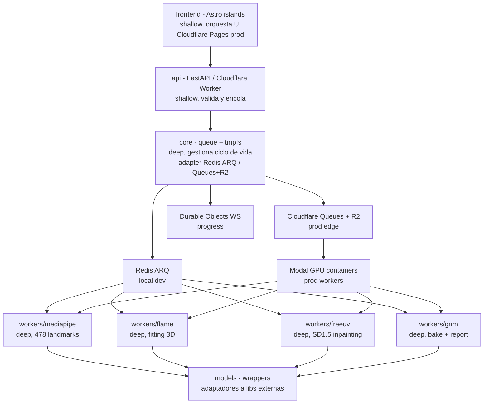
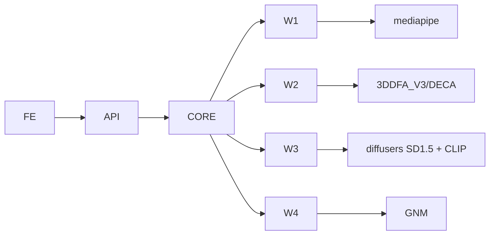

# ARCHITECTURE - Vultus

## 1. Objetivo

Este documento describe la forma del sistema, no el flujo.
Explica módulos, seams y decisiones de diseño.
Usa vocabulario de `codebase-design` para seams y profundidad.

## 2. Principios

Stateless por defecto.
No hay persistencia más allá de 60s (local: Redis `EXPIRE 60`; prod: R2 `lifecycle 60s` + Queues `retención 24h` pero `TTL lógico 60s`).
Async por queue, no por threads en API.
Deep modules con interfaces estrechas y lógica profunda dentro.
Infra: `Cloudflare Pages + Workers + Queues + R2 + Durable Objects` para edge + `Modal` para GPU (ver ADR-004).

## 3. Seams

Seam es la frontera pública donde se testean comportamientos sin mirar internos.

### Seam 1 - HTTP API

`POST /v1/compare`, `GET /v1/jobs/{id}`, `WS /v1/jobs/{id}/events`, `GET /health`.
Es la única entrada para el cliente Astro.
Testeable con `axum-test::TestServer` real sin mocks (8 tests: 202 + `status queued`, `GET` queued, paridad `R2PointerQueue`, 400 imagen / faltante / uuid, 404 desconocido, `health`).
Respuestas tipadas `CompareResponse` / `JobResponse` y errores `AppError -> {400,404,500}` con cuerpo `{"detail":...}`.
Contrato en `backend/crates/api`.

### Seam 2 - Queue Contract

`enqueue(EnqueueCommand) -> EnqueuedJob`, `status`, `progress -> (Progress, Stage)`, `set_progress(Progress, Stage)`, `stored_lens -> (usize, usize)`.
Contrato abstracto; implementación dual vía `vultus-core::Queue` con `Store` compartido (`HashMap<JobId, MemoryEntry>`):
- **Local/dev/test:** `MemoryQueue` (guarda longitudes para probar que los bytes fluyen, `r2_keys None`).
- **Prod:** `R2PointerQueue` que simula `Cloudflare Queues + R2` (Queues limita a 128KB/mensaje, se encola solo `{job_id, r2_keys jobs/{id}/a|b}` y los bytes viven en R2; consumo vía `HTTP Pull Consumer` desde Modal).
Testeable con `MemoryQueue` o `R2PointerQueue` sin tocar Cloudflare (`test_r2_pointer_queue_serves_same_seam` prueba paridad).
No se testea Redis ni Queues interno.

### Seam 3 - Worker Contract

`&ImageBytes -> Landmarks (478 JSON) -> FlawUv (UV_LEN) -> CompleteUv (UV_LEN) -> Heatmap (UV_LEN)` vía `MlSidecarClient { landmarks, flame, freeuv }` + `BaseUrl` + `FlamePayload (u32 BE len + landmarks_json + image_bytes)`.
Cada worker es caja negra.
Input imagen golden (`ImageBytes::parse`), output `UV_LEN = 512x512x3 = 786432` verificable.
No se mockean `MediaPipe` ni `FreeUV` entre sí.

No son seams: `fit_flame`, `bake_bfm_to_gnm`, `project_uv`, `compute_heatmap`.
Se cubren indirectamente vía Seam 3.

## 4. Módulos

### 4.1 api

Módulo shallow en Rust (`Axum`).
Valida `multipart`, magic bytes y tamaño vía `ImageBytes::parse` y construye `EnqueueCommand::new(a, b)`.
`AppState(Arc<dyn Queue>)` genérico vía `AppState::new(impl Queue)` para paridad `MemoryQueue` / `R2PointerQueue`.
Errores `AppError::{BadRequest, Domain(CoreError)}` mapean a `400` (validación + `Empty`), `404` (`NotFound`), `500` (`Queue | Ml | Invariant` con `detail internal error`).
`main` retorna `anyhow::Result` con `context` en `bind :8000` y `serve`.
Expone `CompareResponse{job_id, status:"queued"}` (`202`), `JobResponse{job_id, status: JobStatus::as_str}` (`200`) y `WS`.
No contiene lógica de visión.

### 4.2 core

Módulo deep.
Gestiona `Store` compartido, `TTL 60` (`TtlSecs` nutype `1..=3600`), ciclo tipado `Job<Queued|Processing|Done|Failed|Expired>`, `tmpfs` lifecycle y `progress` events.
Esconde detalles de `MemoryQueue` (local) y `R2PointerQueue` (prod `Queues+R2`) tras el mismo trait `Queue`.
Tipos `ImageBytes` + `ImageBytesRef` zero-cost, `R2Key` / `R2Keys` privados, `EnqueuedJob` con `is_r2_pointer()`, `Stage` enum (prohibido `&str`), `Progress::zero()`, `Landmarks` 478 JSON, `FlawUv` / `CompleteUv` / `Heatmap` con `UV_LEN`, `BaseUrl`, `FlamePayload`, `CoreError` taxonómico (`Image | JobId | Progress | R2Key | BaseUrl | Empty | Queue | Ml | NotFound | Invariant`).
Patrón `R2 pointer`: en prod sube bytes a `R2` y encola solo `r2_keys` (Queues <128KB).
Provee `Queue::{enqueue, status, progress, set_progress, stored_lens}` agnósticos a la infra.
Deps nuevas del workspace: `anyhow`, `nutype`, `proptest` (dev).

### 4.3 workers

Cada worker es módulo deep con una sola responsabilidad.
`Worker 1/2/3 ML` viven en sidecar Python Modal tras `POST /ml/landmarks|flame|freeuv` consumido por `MlSidecarClient::new(BaseUrl)` con firmas tipadas (`-> Landmarks`, `-> FlawUv`, `-> CompleteUv`) y errores `Ml::{Transport, BadStatus, Decode, Empty}`.
`Worker 4 CPU` (`bake`, `heatmap`, `report`) vive en Rust `vultus-workers-cpu` con firmas infallibles `compute_heatmap(&CompleteUv, &CompleteUv) -> Heatmap` y `bake_bfm_to_gnm(&FlawUv) -> CompleteUv` (sin dep `image`).
Reciben tipos ya probados, escriben a `/tmp/{job_id}` en tmpfs, retornan tipos con `UV_LEN`.
No conocen HTTP ni frontend.

### 4.4 models

Adaptadores a librerías externas.
Python: sidecar `backend/modal_app.py` (`/ml/landmarks|flame|freeuv`, stubs `{"todo":...}` hasta Fase 1, `gnm_bake_worker` deprecated a `NotImplementedError`).
Rust: CPU puro en `vultus-workers-cpu` (`compute_heatmap`, `bake_bfm_to_gnm`, sin `torch/diffusers/mediapipe/image`).
Son los únicos lugares donde viven esas dependencias.

### 4.5 frontend

Astro 4 con React islands desplegado en `Cloudflare Pages` en prod (static, free, global CDN).
Islas: `UploadDrop`, `ProgressBar`, `UVViewer`, `HeatmapViewer`, `ThreeViewer`.
Comunicación solo vía Seam 1 (en prod `Pages -> Workers` via `wrangler.toml` routing).

## 5. Dependencias

Dirección siempre hacia adentro.
Ningún `models` importa `api` o `core`.
Esto permite testear `workers` sin levantar `FastAPI`.

## 6. Decisiones

### ADR-001 ARQ sobre Celery (histórico, superado por ADR-005)

ARQ era nativo asyncio y no requería `billiard` ni `kombu`.
Al mover la API a Rust, `ARQ` (Python-only) dejó de aplicar.
El contrato actual es trait `Queue` con `MemoryQueue` / `R2PointerQueue` + `Store`, sin Redis ni Celery en código.
Se conserva por contexto, no como decisión vigente.

### ADR-002 FLAME para extracción, GNM para render

FLAME ya tiene fitting y FreeUV entrenado en BFM.
GNM no trae encoder imagen a params.
Usar FLAME para extraer `flaw-uv` y GNM solo para render vía bake evita reentrenar FreeUV.

### ADR-003 Stateless sin Postgres ni S3

Elimina coste de storage y simplifica GDPR.
Local: Redis con `EXPIRE 60` y tmpfs es suficiente para entregar zip en memoria.
Prod: R2 con `lifecycle 60s` + Queues `retención 24h` pero TTL lógico 60s vía Durable Object alarm.
Se pierde cache y re-descarga desde servidor, pero se gana privacidad y simplicidad.

### ADR-004 Cloudflare + Modal como infra elegida

**Decisión:** Edge en `Cloudflare Pages + Workers + Queues + R2 + Durable Objects + Turnstile/WAF` y GPU en `Modal` via `HTTP Pull Consumer`.

**Contexto:** Roadmap barajaba `Vercel + Fly.io + Upstash Redis` ($25-60/mes fijos + GPU) y `GCP`. Se buscaba capa gratuita real con `scale-to-zero` y `egress free`, manteniendo fidelidad forense (FreeUV 12GB VRAM).

**Alternativas descartadas:**
- `Vercel + Fly + Upstash`: $25-60 fijos, egress con coste, Redis gestionado extra.
- `HF Spaces`: requiere PRO $9/mes para Docker, sleep 48h, cold start 30-60s, no apto para TTL 60s.
- `100% Cloudflare Workers AI`: `flux-1-schnell` no es FreeUV entrenado en BFM UV, 10k neurons/día ~25 compares, pérdida de fidelidad forense.
- `GCP Cloud Run GPU`: 80-200 usd/mes, sin free tier GPU.

**Consecuencias:**
- Coste fijo prod: `Cloudflare Workers Paid $5/mes` + `Modal $30/mes free` (~9.300 compares gratis), luego `$0.0032/compare` T4. Queues (`10k ops/día free`), R2 (`10GB free`), Pages free.
- Queue debe usar patrón `R2 pointer` por límite `128KB` de Queues; `core.queue` abstrae `Redis ARQ` local vs `Queues+R2` prod.
- Workers GPU despliegan con `modal deploy` y consumen Queues vía `HTTP Pull Consumer` (no binding Worker).
- `wrangler.toml` versiona edge, `modal_app.py` versiona GPU. Paridad local intacta con `docker compose` + Redis.

### ADR-005 Híbrido Rust + Python sidecar ML (supera a ADR-001 en API)

**Decisión:** `Seam 1 API + Seam 2 queue + Worker 4 CPU` en Rust (`Axum + tokio`, `backend/crates/`). `Worker 1/2/3 ML GPU` se quedan en Python (`backend/modal_app.py`) tras contrato HTTP `POST /ml/landmarks|flame|freeuv` consumido por `MlSidecarClient` en `vultus-core`.

**Contexto:** ADR-001 elegía `ARQ` por ser asyncio nativo. Al mover la API a Rust, `ARQ` (Python-only) y `Modal SDK` (Python-only) no son portables. Reescribir `MediaPipe/FLAME/FreeUV` a `ort/candle/burn` costaría meses y rompería fidelidad forense (golden `sha256(uv)`).

**Consecuencias:**
- Rust nunca importa `torch/diffusers/mediapipe`. Frontera: tipos probados por HTTP + `X-Job-Id` vía `BaseUrl::join` y `FlamePayload`.
- `gnm_bake_worker` Python queda deprecated (`NotImplementedError`); `compute_heatmap(&CompleteUv, &CompleteUv) -> Heatmap` + `bake_bfm_to_gnm(&FlawUv) -> CompleteUv` viven en `vultus-workers-cpu` (infallibles, tests `black_heatmap` con `UV_LEN`) sin dep `image`.
- `wrangler.toml` sin `python_workers`; edge es gateway fino, API pesada en Rust.
- `Dockerfile` compila binario Rust; `Dockerfile.gpu` solo sidecar Python.

### ADR-006 Parse-don-t-validate con typestate + proptest

**Decisión:** Dominio con tipos opacos que prueban en `parse` (`ImageBytes` + `ImageBytesRef` zero-cost, `JobId` trim, `R2Key`, `Landmarks` 478 JSON, `FlawUv` / `CompleteUv` / `Heatmap` con `UV_LEN`, `BaseUrl`, `TtlSecs` nutype) y ciclo `Job<State>` con moves.
Errores taxonómicos `CoreError` (+ `ImageError`, `BaseUrlError`, `MlError`, `QueueError`) con mapeo fijo `AppError -> 400|404|500`.
Propiedades con `proptest` (`parse_never_panics`, rangos, `R2Key`), golden literales para heatmap.

**Contexto:** El diff mostraba `Vec<u8>` y `&str` sueltos cruzando seams (`enqueue(a,b)`, `stage: &str`, `job.status String`, `base_url String`).
Eso permitía `..` en R2, `UV` de largo wrong y `stage` typo en compilación.

**Consecuencias:**
- `Queue` recibe `EnqueueCommand`, no bytes sueltos; `set_progress` exige `Stage`, no `&str`.
- `EnqueuedJob` / `R2Keys` con campos privados y `is_r2_pointer()`.
- `MlSidecarClient` devuelve `Landmarks` / `FlawUv` / `CompleteUv`, no `Vec<u8>`.
- `workers_cpu` es infallible porque la prueba ya ocurrió en el borde.

## 7. Data Flow

Imagen entra como `bytes` y nunca toca disco persistente más allá de `tmpfs`/`R2 60s`.
Prod: `Browser -> R2 PutObject (via Worker presigned) -> Queues {job_id, r2_keys} -> Modal workers leen R2 -> /tmp tmpfs -> R2 result.zip -> Worker StreamingResponse`.
Local: `Browser -> FastAPI -> Redis ARQ bytes -> workers -> /tmp -> Redis bytes -> StreamingResponse`.
El bundle final viaja `worker -> R2/Rredis bytes -> API/Worker -> StreamingResponse`.
Ningún artefacto se guarda en S3/Postgres persistente. `R2 lifecycle 60s` garantiza olvido.

## 8. Escalado

Local: `worker-cpu` y `worker-gpu` escalan independiente vía `docker compose --scale`.
Prod: `Cloudflare Workers` autoescala edge a 0, `Modal` autoescala GPU `0 -> 100` con `10 GPU concurrency` en Starter free y `50` en Team, `1-2s` cold start.
`FreeUV` es cuello de botella y debe tener `concurrency=1` por GPU para no OOM.
`MediaPipe` puede tener `concurrency=4` en CPU.
R2 y Queues escalan sin gestión (queues `10k ops/día free`, luego `$0.40/M ops`).

## 9. Observabilidad

`core` emite `duration_ms` por etapa y `vram_mb`.
`GET /health` verifica `queue ping` (Redis `PING` local / Queues health en prod) y `torch.cuda.is_available` en Modal.
En prod: `Cloudflare Analytics + Workers Logs` (3 días free), `Durable Objects` para progress, `Modal logs` para GPU.
Logs con `job_id` sin bytes.
Métricas expuestas para `OpenTelemetry`.

## 10. Testing

Seam 1 con `axum-test::TestServer` real (8 tests).
Seam 2 con `MemoryQueue` y `R2PointerQueue` (`stored_lens`, `progress`, `unknown is NotFound`).
Seam 3 con golden `UV_LEN` (`black_heatmap`, `known_diff [6,10]`, `wrong_uv_length_rejected_at_parse`) y `Landmarks` 478.
`proptest` para `parse_never_panics` y rangos.
Nada de unit tests a `fit_flame` interno.
36 tests en verde (`8 seam1 + 25 core + 3 workers_cpu`).
Ver `CONTEXT.md` y `PIPELINE.md` para contratos.
