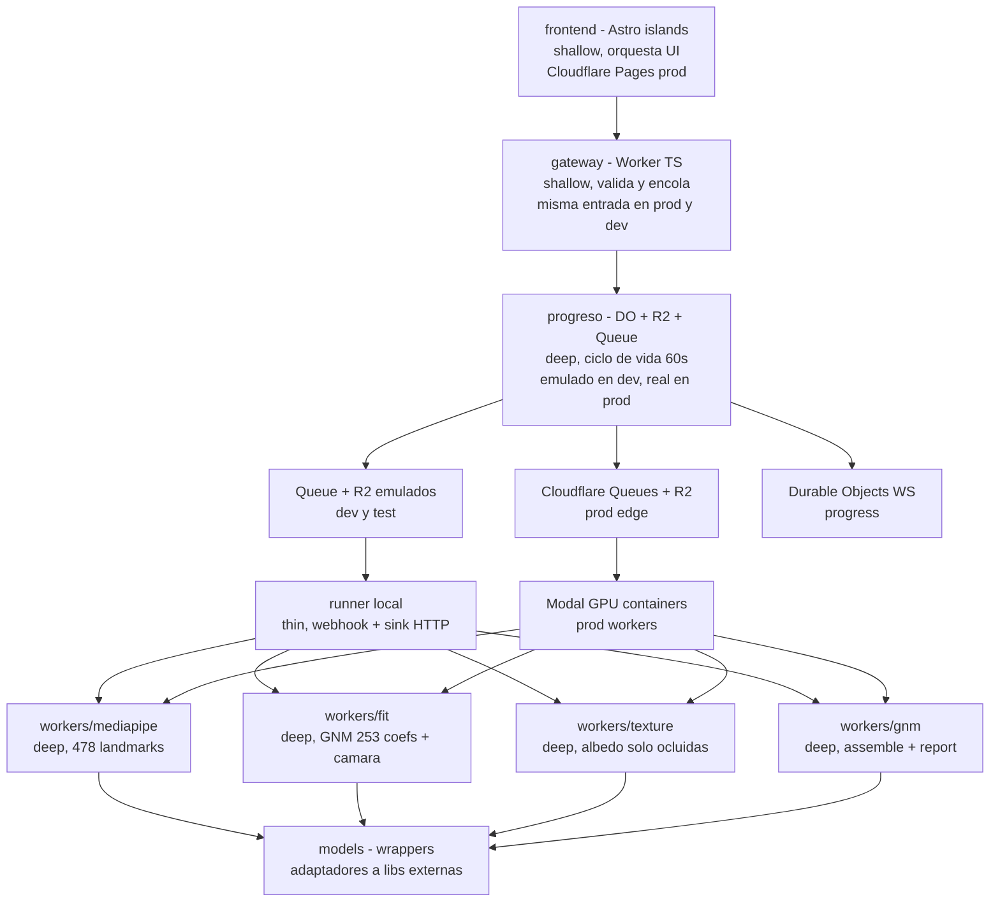
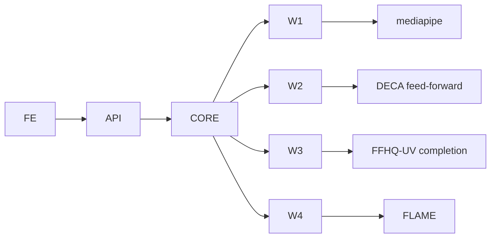

# ARCHITECTURE - Vultus

> Estado objetivo sin Rust ni API Python (plan-single-gateway-ts): un solo dueno por seam.
> TypeScript es fuente de verdad del contrato HTTP y dueno del gateway (`edge/worker.ts`, entrada dev `edge/worker.dev.ts`).
> Python es dueno del runner local (`backend/local_runner.py`), el orquestador (`backend/pipeline_local.py`) y el assemble CPU (`backend/gnm_assemble.py`).
> Comandos nuevos: `pip install -r backend/requirements-api.txt`, `mypy --strict backend/domain.py backend/flame_fit.py backend/flame_texture.py backend/gnm.py backend/pipeline_local.py backend/local_runner.py backend/gnm_assemble.py`,
> `pytest backend/tests -q`, `npx vitest run edge/contract.test.ts`, pool suite `npx vitest run --config vitest.pool.config.ts` (desde `frontend/`).
> Gate visual: `python3 scripts/e2e-flame-real.py` (margen + SSIM con pesos reales) y `bash scripts/modal-weights-sync.sh --check` (puente + cutover + backup).

## 1. Objetivo

Este documento describe la forma del sistema, no el flujo.
Explica módulos, seams y decisiones de diseño.
Usa vocabulario de `codebase-design` para seams y profundidad.

## 2. Principios

Stateless por defecto.
No hay persistencia más allá de 60s (local: DO TTL 60s + purga a 2xTTL con R2/Queue emulados; prod: R2 `lifecycle 60s` + Queues `retención 24h` pero `TTL lógico 60s`).
Async por queue, no por threads en el gateway.
Deep modules con interfaces estrechas y lógica profunda dentro.
Infra: `Cloudflare Pages + Workers + Queues + R2 + Durable Objects` para edge + `Modal` para GPU (ver ADR-004).

## 3. Seams

Seam es la frontera pública donde se testean comportamientos sin mirar internos.

### Seam 1 - HTTP API

`POST /v1/compare`, `GET /v1/jobs/{id}`, `WS /v1/jobs/{id}/events`, `GET /health`.
Es la única entrada para el cliente Astro.
Testeable con suite pool en runtime real sin mocks (6 tests: 202 + `status queued`, `GET` queued, 400 imagen / faltante / uuid, 404 desconocido, 409 pre-done, `health` con `gateway:"worker"`, expiración `expired`) mas WS real (snapshot `queued`, handshake falla en desconocido) y negativo del backdoor dev (`404` con vars prod).
Respuestas tipadas `CompareResponse` / `JobResponse` y errores `-> {400,404,500}` con cuerpo `{"detail":...}`.
Contrato en `edge/contract.ts` (fuente única) con gateway en `edge/worker.ts` y entrada dev en `edge/worker.dev.ts`.

### Seam 2 - Progress Sink

`report(Progress, Stage)`, `complete(CompareResult)`, `fail()`.
Contrato estrecho entre pipeline y progreso, misma forma en local y prod:
- **Local/dev/test:** `HttpProgressSink` en el runner (`POST /progress`, `PUT /dev/results`) e `InMemorySink` en tests.
- **Prod:** los workers GPU reportan al mismo seam HTTP y escriben `result.zip` a R2.
Testeable con el sink en memoria sin tocar Cloudflare.
No se testea Queues/R2 interno de Cloudflare.

### Seam 3 - Worker Contract

`&ImageBytes + &Landmarks -> FitResult (253 coefs + camara, DECA feed-forward) -> RenderedImage (UV_LEN, piel completa) + EyeTexture (ojos separados)` vía `MlSidecarClient { landmarks, fit, texture }` + `BaseUrl` + wire versionado `FitRequest`/`TextureRequest` v2 (`VERSION u8 + u32 BE len + body`) espejado en `pipeline_local.py` y `modal_app.py`.
Cada worker es caja negra.
Input imagen golden (`ImageBytes::parse`), output `UV_LEN = 512x512x3 = 786432` verificable, cero `SKIN_SENTINEL = (255,0,255)` en mascara skin, `evidence >= 0.99`.
No se mockean `fit` ni `texture` entre sí.
`VersionMismatch` (400) para wire v1 o version desconocida; consumo exacto sin bytes sobrantes.

No son seams: `flame_distance`, `displaced_positions`, particion piel/ojo y PBR internos.
Se cubren indirectamente vía Seam 3.

## 4. Módulos

```mermaid
graph TD
    FE[frontend - Astro islands<br/>shallow, orquesta UI<br/>Cloudflare Pages prod]
    API[gateway - Worker TS<br/>shallow, valida y encola<br/>misma entrada en prod y dev]
    CORE[progreso - DO + R2 + Queue<br/>deep, ciclo de vida 60s<br/>emulado en dev, real en prod]
    CFQ[Cloudflare Queues + R2<br/>prod edge]
    LOCAL[Queue + R2 emulados<br/>dev y test]
    RN[runner local<br/>thin, webhook + sink HTTP]
    MO[Modal GPU containers<br/>prod workers]
    W1[workers/mediapipe<br/>deep, 478 landmarks]
    W2[workers/fit<br/>deep, GNM 253 coefs + camara]
    W3[workers/texture<br/>deep, albedo solo ocluidas]
    W4[workers/gnm<br/>deep, assemble + report]
    MODELS[models - wrappers<br/>adaptadores a libs externas]
    DO[Durable Objects WS<br/>progress]

    FE --> API
    API --> CORE
    CORE --> CFQ
    CORE --> LOCAL
    CORE --> DO
    CFQ --> MO
    LOCAL --> RN
    RN --> W1 & W2 & W3 & W4
    MO --> W1 & W2 & W3 & W4
    W1 & W2 & W3 & W4 --> MODELS
```

### 4.1 gateway

Módulo shallow en TypeScript (`edge/worker.ts` en prod, `edge/worker.dev.ts` en dev).
Valida `multipart`, magic bytes y tamaño vía el contrato y encola solo `{job_id, r2_keys}`.
La entrada dev agrega exactamente dos rutas (`GET /dev/blobs`, `PUT /dev/results`, solo con `ALLOW_DEV_ROUTES=1`) y el consumer dev hacia el webhook del runner.
Errores mapean a `400` (validación), `404` (`NotFound`), `500` (bindings) con cuerpo `{"detail":...}`.
Expone `CompareResponse{job_id, status:"queued"}` (`202`), `JobResponse{job_id, status}` (`200`), `GET /health` con `gateway:"worker"` y `WS`.
No contiene lógica de visión.

### 4.2 progreso y cómputo

Módulo deep en edge (`ProgressDO` + R2 + Queue).
Gestiona ciclo `queued->processing->done|failed|expired`, `TTL 60`, ventana `expired` visible y purga a 2xTTL.
Tipos del contrato (`JobId`, `TtlSecs`, `Progress`, `Stage`, `JobStatus`) con smart constructors que retornan `Result`; el pipeline recibe tipos ya probados.
Patrón `R2 pointer`: el worker sube bytes a `R2` y encola solo `r2_keys` (Queues <128KB).
El runner local (`backend/local_runner.py`, thin, solo stdlib) implementa el sink sobre HTTP; los tests lo implementan en memoria.
Deps compute local: `httpx/Pillow/numpy` (ver `backend/requirements-api.txt`).

### 4.3 workers

Cada worker es módulo deep con una sola responsabilidad.
`Worker 1/2/3 ML` viven en sidecar Python Modal tras `POST /ml/landmarks|fit|texture` consumido por `MlSidecarClient` con firmas tipadas (`-> Landmarks`, `-> FitResult`, `-> RenderedImage`).
`fit` es frente geometrico 68 landmarks estilo Deep3D (`backend/flame_fit.py`, determinista x2, deadline 10s, `Result` total sin `raise`).
Identidad desde 10 ratios 68lm, detalle condicionado a identidad+pesos sin bytes de foto, loss = residual de simetria (no 0 fijo).
La regresion sobre base HiFi3D++ con torch vive en el worker GPU Modal; sin `torch` top-level.
`texture` es unwrap por proyeccion FFHQ-UV (`backend/flame_texture.py`, `SKIN_SENTINEL` const en codigo, `evidence >= 0.99`, `concurrency_limit=1`).
Atlas 512 = pixel <-> UV piel 0-1; cada texel cubierto se muestrea de la foto por proyeccion afine del template real, ocluidas con completion + detalle de checkpoint.
Ojos en textura aparte via `bake_eye_texture`; el atlas nunca muestrea fondo (cobertura de malla 88.7%).
El `.mat` denso apunta a malla 20k (divergencia documentada): gate de presencia + mascara, mapeo rasterizado del FLAME 5023.
`Worker 4 CPU` (`assemble`) vive en `backend/gnm_assemble.py`: malla FLAME `VERT_COUNT = 5023`, ojos `[EYE_VERT_START:EYE_VERT_END) = [3931:5023)` (1092 verts) con material propio, 2 primitivas PBR real (`SkinPBR` + `EyePBR`, sin emisivo), `build_personalized_glb(fit, albedo, eye_texture?) -> GnmMesh`, zip-6 via `build_result_zip` en `backend/gnm.py` (sin dep `torch/diffusers/mediapipe`).
Fixture local es cabeza coherente (elipsoide piel + 2 esferas ojos, UVs piel 0-1 ojos 2-3), no rejilla plana.
Sin `flame_template.bin` hay waiver local salvo con `VULTUS_REAL_ML=1` que falla loud.
Template real se congela con `scripts/extract_flame_template.py` desde `flame2023_Open.pkl` + `FLAME_w_HIFI3D_UV.obj`.
Ojos reales via `bake_eye_texture` cuando el puente trae `eye_ball_tex.png`, si no blanco fallback.
Imagen Modal trae `pytorch3d@978cd99` desde source y `nvdiffrast` best-effort para futuro fitting iterativo (el unwrap actual usa raster propio numpy).
Puente ampliado a 7 archivos: base 4 mas `checkpoints/texgan_model/texgan_ffhq_uv.pth`, `checkpoints/deep3d_model/epoch_latest.pth` y `topo_assets/unwrap_1024_info.mat`.
Env nuevos `TEXGAN_DIR`, `DEEP3D_DIR`, `TOPO_DIR` con defaults bajo `WEIGHTS_ROOT`, pasados a fit y texture workers.
Template real `backend/assets/flame_template.bin` (5023/9976, sha `d4140b7b`) generado desde `flame2023_Open.pkl` + `FLAME_w_HIFI3D_UV.obj` con UVs last-wins (5150 vt con seams).
`hifi3dpp_mean_face.obj` ausente en HF y Volume: documentado, no bloquea extras.
Fitting sigue feed-forward una pasada dentro de `5+10+30` en TTL 60 con drain `visibility180`; sin fitting iterativo.
Loader GNM `17821/35324` se conserva solo hasta el cutover (ver ADR-008); el bake gris legacy (`gnm_texture.build_albedo`) falla ruidoso sin pesos, sin caller productivo.
Sin pesos los dobles locales siguen (gateway en verde); con `VULTUS_REAL_ML=1` el fallo es ruidoso (`FitFailed`/`MlFailed`).
Reciben tipos ya probados, escriben a `/tmp/{job_id}` en tmpfs, retornan tipos con `UV_LEN`.
No conocen HTTP ni frontend.

### 4.4 models

Adaptadores a librerías externas.
Python: sidecar `backend/modal_app.py` (`/ml/landmarks|fit|texture`, delegados a `backend/flame_fit.py` y `backend/flame_texture.py`) y assemble CPU `backend/gnm_assemble.py` (`build_personalized_glb`, `build_result_zip` de 6 nombres).
Son los únicos lugares donde viven esas dependencias (`torch/mediapipe` solo vía `modal_app.py` + `flame_*`; `diffusers` sigue pineado en `requirements.txt` pero ningun modulo lo importa: candidato a retirar junto a los pesos GNM).

### 4.5 frontend

Astro 4 con React islands desplegado en `Cloudflare Pages` en prod (static, free, global CDN).
Islas: subida + progreso, `UvViewers` (paneles `uv_a/uv_b` + `pbr_a/pbr_b`, sin heatmap ni slider), `ThreeViewer` (estudio blanco, 2 canvas `viewer-3d-a/b`, conserva materiales GLB + fallback PBR).
Comunicación solo vía Seam 1 (en prod `Pages -> Workers` via `wrangler.toml` routing).
`/health` expone `contract_version` (v2 = zip-6); el frontend valida y muestra `actualiza` ante mismatch, cero panel roto.

## 5. Dependencias

```mermaid
graph LR
    FE --> API
    API --> CORE
    CORE --> W1 & W2 & W3 & W4
    W1 --> M1[mediapipe]
    W2 --> M2[DECA feed-forward]
    W3 --> M3[FFHQ-UV completion]
    W4 --> M4[FLAME]
```

Dirección siempre hacia adentro.
Ningún `models` importa `api` o `core`.
Esto permite testear `workers` sin levantar `FastAPI`.

## 6. Decisiones

### ADR-001 ARQ sobre Celery (histórico, superado por ADR-005)

ARQ era nativo asyncio y no requería `billiard` ni `kombu`.
Al mover la API a Rust, `ARQ` (Python-only) dejó de aplicar.
El contrato actual es trait `Queue` con `MemoryQueue` / `R2PointerQueue` + `Store`, sin Redis ni Celery en código.
Se conserva por contexto, no como decisión vigente.

### ADR-002 Fit GNM directo (supera a FLAME-para-extracción)

**Decisión (plan-gnm-fit-texture-pbr):** fit GNM directo (253 coefs + camara),
proyeccion foto + warp TPS, inpaint solo de ocluidas, 5 islas + PBR + assemble.

**Contexto (histórico, superado):** antes FLAME extraía `flaw-uv` y GNM solo
renderizaba vía bake para evitar reentrenar FreeUV. La malla resultante era un
template estatico con textura lavada: los parametros de forma se descartaban.

**Consecuencias:**
- Se retiran: `FlawUv`, `FlamePayload`, endpoints `/ml/flame|freeuv`, LUT v2,
  `bake_bfm_to_gnm` y el GLB neutro.
- Compare = distancia de coefs + diferencia de albedo; el heatmap sobrevive.

### ADR-003 Stateless sin Postgres ni S3

Elimina coste de storage y simplifica GDPR.
Local: `Store` con `TTL 60` + reaper a 2xTTL y tmpfs es suficiente para el job dummy en memoria (sin `Redis`).
Prod: R2 con `lifecycle 60s` + Queues `retención 24h` pero TTL lógico 60s vía Durable Object alarm.
Se pierde cache y re-descarga desde servidor, pero se gana privacidad y simplicidad.

### ADR-004 Cloudflare + Modal como infra elegida

**Decisión:** Edge en `Cloudflare Pages + Workers + Queues + R2 + Durable Objects + Turnstile/WAF` y GPU en `Modal` via `HTTP Pull Consumer`.

**Contexto:** Roadmap barajaba `Vercel + Fly.io + Upstash Redis` ($25-60/mes fijos + GPU) y `GCP`. Se buscaba capa gratuita real con `scale-to-zero` y `egress free`, manteniendo fidelidad forense (FreeUV 12GB VRAM).

**Alternativas descartadas:**
- `Vercel + Fly + Upstash`: $25-60 fijos, egress con coste, Redis gestionado extra.
- `HF Spaces`: requiere PRO $9/mes para Docker, sleep 48h, cold start 30-60s, no apto para TTL 60s.
- `100% Cloudflare Workers AI`: `flux-1-schnell` no es FreeUV entrenado en BFM UV, 10k neurons/día ~25 compares, pérdida de fidelidad forense.
- `GCP Cloud Run GPU`: 80-200 usd/mes, sin free tier GPU.

**Consecuencias:**
- Coste fijo prod: `Cloudflare Workers Paid $5/mes` + `Modal $30/mes free` (~9.300 compares gratis), luego `$0.0032/compare` T4. Queues (`10k ops/día free`), R2 (`10GB free`), Pages free.
- Queue debe usar patrón `R2 pointer` por límite `128KB` de Queues; `core.queue` abstrae `MemoryQueue` local vs `Queues+R2` prod (sin `Redis`).
- Workers GPU despliegan con `modal deploy` y consumen Queues vía `HTTP Pull Consumer` (no binding Worker).
- `wrangler.toml` versiona edge, `modal_app.py` versiona GPU. Paridad local intacta con `docker compose` + `Store` en memoria (sin `Redis`).

### ADR-005 Híbrido Rust + Python sidecar ML (supera a ADR-001 en API)

**Decisión (histórico Rust, superado):** antes `Seam 1 API + Seam 2 queue + Worker 4 CPU` en Rust (`Axum + tokio`, `backend/crates/`, borrado). Hoy Python es dueno (`backend/pipeline_local.py`, `backend/gnm_assemble.py`) y `Worker 1/2/3 ML GPU` siguen en Python (`backend/modal_app.py`) tras `POST /ml/landmarks|fit|texture`.

**Contexto:** ADR-001 elegía `ARQ` por ser asyncio nativo. Al mover la API a Rust, `ARQ` (Python-only) y `Modal SDK` (Python-only) no son portables. Reescribir el fitting a `ort/candle/burn` costaría meses y rompería fidelidad forense.

**Consecuencias:**
- Rust nunca importa `torch/diffusers/mediapipe`. Frontera: tipos probados por HTTP + `X-Job-Id` vía `BaseUrl::join`, `FitRequest` y `TextureRequest`.
- `compute_heatmap(&CompleteUv, &CompleteUv) -> Heatmap` + `build_personalized_glb(&FitResult, &CompleteUv)` viven en CPU (infallibles salvo assets corruptos, tests con `UV_LEN`) sin dep `image`.
- `wrangler.toml` sin `python_workers`; edge es gateway fino, API pesada en Rust.
- `Dockerfile` compila binario Rust; `Dockerfile.gpu` solo sidecar Python.

### ADR-006 Parse-don-t-validate con tipos probados + goldens

**Decisión:** Dominio con tipos probados que prueban en `parse` (`ImageBytes`, `JobId` trim, `R2Key`, `Landmarks` 478 JSON, `GnmCoeffs` 253 finitos, `CameraParams` 12 finitos, `UvRegion` 1-5, `CompleteUv`/`RenderedImage`/`EyeTexture` con `UV_LEN`, `BaseUrl`, `TtlSecs`, `ContractVersion`) y ciclo con estados separados.
Errores taxonómicos `CoreError` (+ `ImageError`, `BaseUrlError`, `MlError`, `QueueError`, `InvalidCoeffs`, `InvalidCamera`, `FitFailed`, `VersionMismatch`) con mapeo fijo `AppError -> 400|404|500`.
Goldens literales a mano (`Progress`, `TtlSecs`, `R2Key`, zip-6 sin heatmap, `SKIN_SENTINEL` ausente + `evidence >= 0.99`, eye slice 1092, GLB magic FLAME 5023), relojes manuales sin sleeps.
`Heatmap`/`parse_heatmap`/`compute_heatmap` retirados (ADR-008); `CompleteUv` sobrevive solo como parsing legacy del wire, el seam produce `RenderedImage`.

**Contexto:** El diff mostraba `Vec<u8>` y `&str` sueltos cruzando seams (`enqueue(a,b)`, `stage: &str`, `job.status String`, `base_url String`).
Eso permitía `..` en R2, `UV` de largo wrong y `stage` typo en compilación.

**Consecuencias:**
- `Queue` recibe `EnqueueCommand`, no bytes sueltos; `set_progress` exige `Stage`, no `&str`.
- `EnqueuedJob` / `R2Keys` con campos privados y `is_r2_pointer()`.
- `MlSidecarClient` devuelve `Landmarks` / `FitResult` / `CompleteUv`, no `Vec<u8>`.
- `workers_cpu` es infallible porque la prueba ya ocurrió en el borde.

### ADR-007 Edge GET lee Durable Object (no dummy)

**Decisión:** `GET /v1/jobs/{id}` en edge lee el `ProgressDO` (`GET /status`) como fuente de verdad. Dummy `queued` solo como fallback si el binding DO falta en `wrangler dev`.

**Contexto:** El gateway devolvía `queued` siempre, lo que ocultaba `processing/expired` y devolvía `queued` para jobs desconocidos. Rust en cambio distingue `queued/processing/expired` y `404`.

**Consecuencias:**
- `POST /v1/compare` hace `/init` en el DO; `GET` hace `/status`; `WS` va al DO directo.
- DO sin `init` responde `404`, tras `alarm` 2xTTL purga y vuelve a `404`. Paridad con `Store::purge_expired`.
- `wrangler dev` sin binding sigue con fallback `queued` solo para smoke local, nunca en prod.

### ADR-008 Corte heatmap y gris honesto, Seam 3 sin Heatmap (revoca ADR-002)

**Decisión (plan-flame-deca-render Wave 1):** se abandona el gris honesto y el heatmap en el mismo corte. La textura se completa hasta piel total, los ojos van a textura separada, el material pasa a PBR real y el visor a estudio blanco. Revoca ADR-002 (ver `ARCHITECTURE.md:152`, Fit GNM directo con `Compare = distancia de coefs + diferencia de albedo; el heatmap sobrevive`): el heatmap ya no sobrevive.

**Contexto:** el comparador producía UV con gris medio en ocluidas y un heatmap que nadie quiere mirar. El atlas disperso nunca se vería como la referencia por más que se arregle el particionado. Mantener ambos a medias cuesta más que quitarlos.

**Redefinición de Seam 3:** `&ImageBytes + &Landmarks -> FitResult (253 coefs + camara) -> RenderedImage (UV_LEN, piel completa) + EyeTexture (UV_LEN, ojos separados)` vía `MlSidecarClient { landmarks, fit, texture }`. `compute_heatmap` deja de ser parte del seam y se retira; `CompareResult` pierde `heatmap`; el zip canónico pasa a 6 piezas sin `heatmap.png`. Lo local conserva gateway en verde con dobles; lo visual solo se valida en Modal con el zip real.

**Disclosure pericial:** la completion es visual, distinta de evidencia. El gris honesto marcaba oclusión como ausencia de dato; la piel completada alucina plausibilidad y no debe leerse como medición forense. El perito debe saber que el corte fue intencional.

**Consecuencias:**
- `backend/domain.py` es dueño del zip-6 sin `Heatmap`; `edge/contract.ts` espeja los 6 nombres.
- `VersionMismatch` es variante frozen con mapeo exhaustivo para codec versionado (Wave 2).
- Borrado seguro posterior: puente nuevo, cutover de código, y solo entonces borrado de pesos GNM del Volume, nunca antes.

### ADR-009 Quedarse en FLAME 5023 (densa HiFi3D++ evaluada y rechazada este ciclo)

**Decisión (issue 94 Fase 4):** la malla del contrato sigue siendo FLAME 5023/9976 personalizada. La malla densa HiFi3D++ (20481/40832) se evaluó con el mismo fit Bush en ambas topologías (renders comparativos efímeros fuera del repo): la densa captura más detalle geométrico (nariz, labios, orejas), pero se rechaza este ciclo.

**Contexto:** la densa es la salida directa de Deep3D (`reconstruct_dense` en `backend/deep3d.py`, verificada: 20481v/40832f, determinista) sin pérdida de transferencia. La personalización FLAME ya converge en identidad (margen misma<distinta en verde) y el desplazamiento es milimétrico real, no template genérico.

**Por qué no densa ahora:**
- Rompe el contrato 5023 en `edge/contract.ts`, zip-6, visor, extractor, Volume, tests y `BRIDGE_FILES`: migración mayor (versión de contrato + migración de `flame_template.bin` + visor nuevo) sin beneficio forense proporcional (el comparador vive de distancia de coefs + albedo, ambos verdes en FLAME).
- HiFi3D++ no trae globos oculares: el contrato exige la primitiva `EyePBR` con textura real (ya cableada en FLAME); la densa pediría el port de `Mesh_Add_EyeBall` upstream.
- El unwrap 512 y el raster están construidos sobre las UVs FLAME (`FLAME_w_HIFI3D_UV.obj`); la densa exigiría su propio unwrap 1024 + parsing de cuello/cuero cabelludo (pelo) que hoy no existe.
- GLB 4x más pesado dentro del mismo TTL 60 sin ganancia de evidencia (la evidencia es del albedo, no de la densidad).

**Consecuencias:**
- `reconstruct_dense` queda como herramienta de decisión/evaluación, nunca en el path productivo.
- Si un futuro ciclo quiere la densa, este ADR se revoca con migración por seams (tests de contrato primero, versión mayor).
- Renders comparativos del mismo job Bush en ambas topologías: evidencia efímera de la decisión (no se commitean: derivan de foto LFW).

## 7. Data Flow

Imagen entra como `bytes` y nunca toca disco persistente más allá de `tmpfs`/`R2 60s`.
Prod: `Browser -> Worker POST /v1/compare -> R2 PutObject -> Queues {job_id, r2_keys} -> Modal workers leen R2 -> /tmp tmpfs -> R2 result.zip -> Worker StreamingResponse`.
Local: `Browser -> Worker dev -> R2/Queue emulados -> runner webhook -> /tmp tmpfs -> PUT /dev/results -> GET status / WS events`.
El bundle final viaja `R2 bytes -> Worker -> StreamingResponse` en prod; en local el runner lo escribe por la ruta dev.
Ningún artefacto se guarda en S3/Postgres persistente. `R2 lifecycle 60s` garantiza olvido.

## 8. Escalado

Local: `worker-cpu` y `worker-gpu` escalan independiente vía `docker compose --scale`.
Prod: `Cloudflare Workers` autoescala edge a 0, `Modal` autoescala GPU `0 -> 100` con `10 GPU concurrency` en Starter free y `50` en Team, `1-2s` cold start.
`texture` es cuello de botella y debe tener `concurrency=1` por GPU para no OOM.
`MediaPipe` puede tener `concurrency=4` en CPU.
R2 y Queues escalan sin gestión (queues `10k ops/día free`, luego `$0.40/M ops`).

## 9. Observabilidad

`core` emite `duration_ms` por etapa y `vram_mb`.
`GET /health` verifica `queue ping` (`Store` probe `NotFound` local / Queues health en prod) y `torch.cuda.is_available` en Modal.
En prod: `Cloudflare Analytics + Workers Logs` (3 días free), `Durable Objects` para progress, `Modal logs` para GPU.
Logs con `job_id` sin bytes.
Métricas expuestas para `OpenTelemetry`.

## 10. Testing

Seam 1 con suite pool en runtime real (6 tests) + WS real.
Seam 2 con sink en memoria (`report` ordenado, `complete`, `fail`).
Seam 3 con golden `UV_LEN` (fit v2 `VERSION + u32 BE`, `GLB magic` FLAME `5023` verts + `SkinPBR`/`EyePBR` sin emisivo, eye slice `1092`, cero sentinel) + `Landmarks` 478 rechaza stubs.
Goldens literales y tipos probados en el borde.
Nada de unit tests al pipeline interno.
Gate visual: `python3 scripts/e2e-flame-real.py` (margen estricto + SSIM misma>distinta, landmarks reales, fotos congeladas por sha256) y `bash scripts/modal-weights-sync.sh --check` (puente + cutover + backup por contenido).
Ver `CONTEXT.md` y `PIPELINE.md` para contratos.
