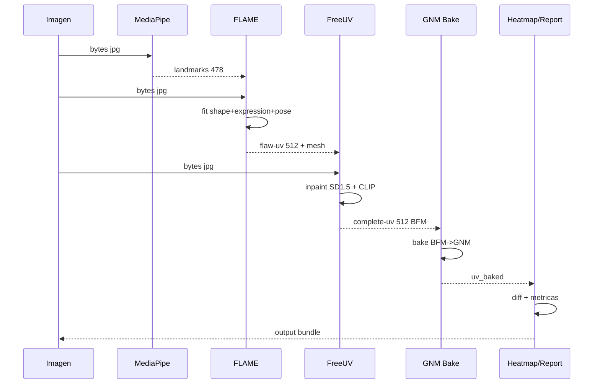
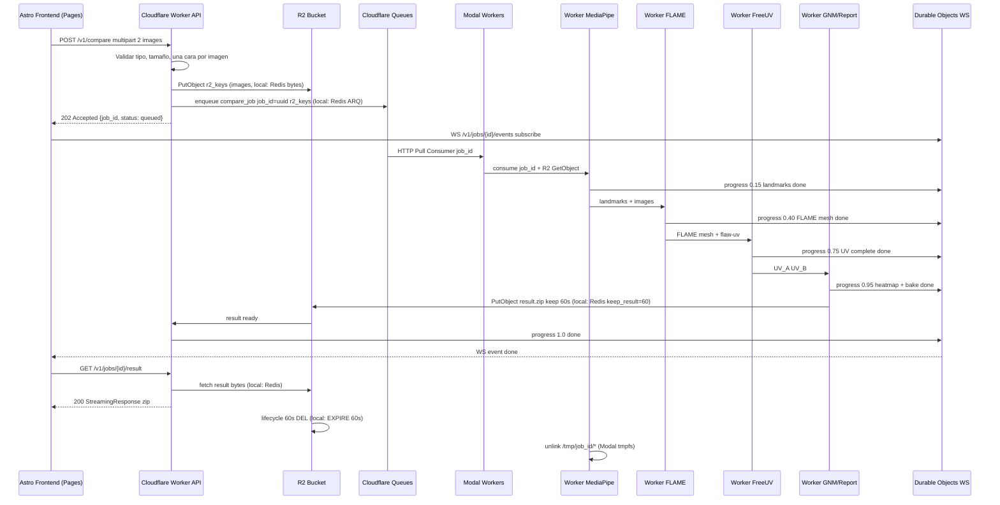

# PIPELINE - Flujo Completo Vultus

## 1. Resumen

Este documento describe el flujo end-to-end desde que el usuario sube 2 caras hasta que descarga el resultado.
El pipeline es asíncrono, stateless y sin persistencia.
En prod cada etapa es un worker en `Modal` que consume de `Cloudflare Queues` vía `HTTP Pull Consumer`; en dev local consume de `Redis ARQ` vía el mismo contrato `core.queue`.

## 2. Diagrama de pipeline

> Infra prod: Cloudflare Pages + Workers + Queues + R2 + Durable Objects + Modal. Dev local: Redis ARQ equivalente vía adapter.

```mermaid
graph TD
    A[Cliente Astro - Cloudflare Pages Upload 2 jpgs] --> B[Cloudflare Worker POST /v1/compare]
    B --> C{Validacion + R2 PutObject}
    C -->|ok| D[Enqueue {job_id, r2_keys} a Cloudflare Queues]
    C -->|fail| E[400 Bad Request]
    D --> F[Modal Worker 1 - MediaPipe 478 landmarks CPU]
    F --> G[Modal Worker 2 - FLAME Fitting GPU]
    G --> H[Modal Worker 3 - FreeUV UV completo GPU]
    H --> I[Modal Worker 4 - GNM Bake + Heatmap + Report]
    I --> J[Result bytes en R2 TTL 60s lifecycle]
    J --> K[Cloudflare Worker StreamingResponse zip]
    K --> L[Cliente descarga - UV_A UV_B heatmap mesh PDF]
    J -. lifecycle 60s .-> M[Olvido total - tmpfs wipe + R2 DEL + Queue 24h]
    D -. progress .-> N[Durable Objects WS /v1/jobs/id/events]
    N --> A
    D -. local dev .-> D2[Redis ARQ fallback]
```

## 3. Secuencia de modelos

Esta sección muestra como se encadenan los 4 modelos y que dato produce cada uno.

```mermaid
graph LR
    I[Imagen 512x512] --> M[MediaPipe<br/>Tasks Vision<br/>CPU 25ms]
    M -->|478 landmarks 3D| F[FLAME Fitting<br/>3DDFA_V3 / DECA<br/>GPU 300ms]
    F -->|mesh 5023 verts<br/>+ flaw-uv 512| U[FreeUV<br/>SD1.5 + CLIP<br/>GPU 10s]
    U -->|complete-uv 512| G[GNM Bake<br/>BFM->GNM<br/>CPU 150ms]
    G -->|mesh GNM 10k verts<br/>+ textura horneada| H[Heatmap + Report<br/>CPU 200ms]
    H --> O[Salida: uv_a, uv_b, heatmap, mesh.glb, report.pdf]

    style M fill:#e3f2fd
    style F fill:#fff3e0
    style U fill:#fce4ec
    style G fill:#e8f5e9
    style H fill:#f3e5f5
```



Dependencias por modelo:

- **MediaPipe** es entrada.
No depende de nadie.
Salida `landmarks 478` alimenta a FLAME.

- **FLAME Fitting** depende de `image + landmarks`.
Salida `mesh FLAME + flaw-uv` con huecos por oclusión.
Sin landmarks no puede estimar pose.

- **FreeUV** depende de `flaw-uv + image`.
Salida `complete-uv` sin huecos y con iluminación normalizada.
Es el cuello de botella y corre 2 veces en paralelo, una por cara.

- **GNM Bake** depende de `complete-uv` en topología BFM.
Hace transferencia baricéntrica a topología GNM.
Salida `mesh GNM` texturizado.

- **Heatmap + Report** depende de `complete-uv A y B` ya en mismo espacio canónico.
Calcula `|UV_A - UV_B|` y distancias antropométricas.



Paralelización:

- Cara A y cara B se procesan en paralelo en `MediaPipe -> FLAME -> FreeUV`.
- Cada cara usa su propio chain.
- `GNM Bake` y `Heatmap` esperan a que ambas ramas terminen y hacen join.

## 4. Secuencia detallada end-to-end



## 5. Etapas

### 5.1 Entrada - POST /v1/compare

El cliente envía `multipart/form-data` con `image_a` y `image_b`.
Cada imagen debe ser JPEG o PNG menor a 8MB.
El API valida magic bytes, dimensiones mínimas 256x256 y que MediaPipe detecte exactamente una cara por imagen en validación rápida.
Si falla, retorna `400` con `detail` sin encolar.
Si pasa, genera `job_id` uuid v4, encola en ARQ con `images` como bytes y retorna `202`.

### 5.2 Queue - Cloudflare Queues + R2 (prod) / Redis ARQ (local)

El contrato es `enqueue(job_id, image_a, image_b)` agnóstico a la infra vía `core.queue` adapter.

- **Prod (Cloudflare):** El Worker hace `R2 PutObject` con `image_a/b` y serializa solo `compare_job(job_id, r2_keys)` a `Cloudflare Queues` (límite 128KB/mensaje, no caben 2x8MB). `Cloudflare Queues` cobra `10k ops/día free` (write/read/delete = 3 ops por job -> ~3.333 jobs/día free), retención `24h` en free pero `TTL lógico 60s` vía `Durable Object alarm` + `R2 lifecycle 60s`. Modal consume vía `HTTP Pull Consumer`. El progreso va por `Durable Objects WS`.
- **Local/dev:** `ARQ` serializa directo `compare_job(job_id, image_a_bytes, image_b_bytes)` a `Redis`. TTL `keep_result=60` y `EXPIRE 60s`. Progreso vía `job.progress`.

No hay Postgres ni MinIO persistente. En prod el egress de R2 es free.

### 5.3 Worker 1 - MediaPipe 478 landmarks

Input: `image bytes`.
Output: `landmarks 478 x 3` por imagen.
Runtime CPU, 20-30ms por cara.
Si no detecta cara, falla el job con `error: no_face_detected`.
Escribe landmarks a `/tmp/{job_id}/landmarks.json` en tmpfs.

### 5.4 Worker 2 - FLAME Fitting

Input: `image bytes + landmarks`.
Output: `FLAME mesh` y `flaw-uv` incompleta.
Runtime GPU con `3DDFA_V3` o `DECA`.
Estima `shape, expression, pose` y proyecta a `mesh` con `UV` de BFM.
Genera `flaw-uv` de 512x512 con huecos por oclusión.
Tiempo 200-400ms por cara en T4.

### 5.5 Worker 3 - FreeUV

Input: `flaw-uv` + `image`.
Output: `complete-uv` 512x512.
Runtime GPU con `SD1.5 + CLIP`.
Hace inpainting de regiones ocluidas y normaliza iluminación.
Tiempo 8-12s por cara en T4.
Es la etapa más costosa.

### 5.6 Worker 4 - GNM Bake, Heatmap y Report

Input: `complete-uv` de ambas caras en topología BFM.
Pasos: bake baricéntrico `BFM -> GNM` precomputado, render mesh GNM con textura, cálculo `heatmap = |UV_A - UV_B|` por canal, cálculo de distancias antropométricas normalizadas por interpupilar en UV canónico, generación de `report.pdf` con imágenes originales, UVs, heatmap y tabla de métricas con disclaimer.
Output: `uv_a.png, uv_b.png, heatmap.png, mesh_gnm.glb, report.pdf`.
Runtime CPU/GPU 300-500ms.
Todo se escribe a `/tmp/{job_id}/` y se retorna como dict de bytes.

### 5.7 Entrega - GET /v1/jobs/{id}/result

El frontend pide el resultado tras recibir `WS done` (Durable Objects en prod).
En prod el Worker hace `R2 GetObject(job_id/result.zip)` y en local el API hace `await queue.result(job_id)` (Redis), y arma un `StreamingResponse` con `Content-Type: application/zip` y `Content-Disposition: attachment`.
El zip contiene `uv_a.png, uv_b.png, heatmap.png, mesh_gnm.glb, report.pdf` en memoria, sin escribir a disco.
Tras el stream, en prod `R2 lifecycle 60s` borra solo y en local el API hace `DEL job_id` si aún existe.
El frontend crea `URL.createObjectURL` para descarga y ofrece re-descarga local desde memoria sin volver al servidor.

### 5.8 Limpieza stateless

Cada worker (local Docker o Modal container) hace `unlink` de `/tmp/{job_id}/*` al terminar, éxito o fallo.
Local: `Redis EXPIRE 60` automático. Prod: `R2 lifecycle 60s` + `Queue retención 24h` pero `TTL lógico 60s` vía `Durable Object alarm`.
Logs no contienen bytes de imagen, solo `job_id` y `duration_ms`.
Verificación TDD: `test_compare_does_not_persist_after_delivery` comprueba `redis.exists == 0` (local) / `R2 exists == 0` (prod adapter) y `tmpfs` vacío tras 65s.

## 6. Contratos de datos

Job enqueue: `{job_id: uuid, image_a: bytes, image_b: bytes}` en local; `{job_id, r2_keys}` en prod (adapter traduce). Límite Queues 128KB obliga a `R2 pointer` en prod.
Worker return: `{uv_a: bytes png, uv_b: bytes png, heatmap: bytes png, mesh: bytes glb, report: bytes pdf}` (a Redis local o R2 prod).
Progress events WS: `{job_id, progress: 0.0-1.0, stage: landmarks|flame|freeuv|bake}` vía `Redis` local o `Durable Objects` prod.
Error: `{job_id, status: failed, error: no_face_detected|invalid_image|gpu_oom}`.

## 7. Manejo de errores

Imagen inválida: `400` inmediato sin encolar.
No face: job `failed` con `progress 1.0` y `error` en WS, resultado no se genera.
GPU OOM: reintento 1 vez con `retry` de ARQ, si falla marca `failed`.
Timeout: `job_timeout=30s` por etapa, `max 60s` total.
Cliente cierra pestaña: Redis expira solo, sin leak.

## 8. Observabilidad

Métricas por job: `duration_ms` por etapa, `vram_mb`, `queue_lag_ms` (local) / `Cloudflare Queues lag + Modal GPU util` (prod).
Logs estructurados con `job_id` sin datos biométricos (Workers Logs 3 días free, Modal logs).
Health: `GET /health` verifica `queue ping` (Redis `PING` local / Queues health prod) y `gpu available` (local `nvidia-smi` / Modal `torch.cuda.is_available`). En prod `Cloudflare Analytics` + `OpenTelemetry` + `Sentry` si se configura.

## 9. Escalado

Local: Workers CPU y GPU escalan independiente vía `docker compose --scale`, `ARQ` `concurrency` por worker.
Prod: `Cloudflare Workers` escala a 0 automático, `Modal` escala GPU `0 -> 100` (`Starter 10 GPU concurrency free`, `Team 50`), `1-2s` cold start, R2/Queues sin gestión. `FreeUV concurrency=1` por GPU para no OOM sigue vigente en Modal.
Sin storage persistente, no hay cuello de botella de I/O.
Cache opcional efímera `hash(image) -> UV` en R2 con TTL 60s si se quiere evitar recomputar misma cara en ventana corta, desactivada por defecto por stateless estricto.
