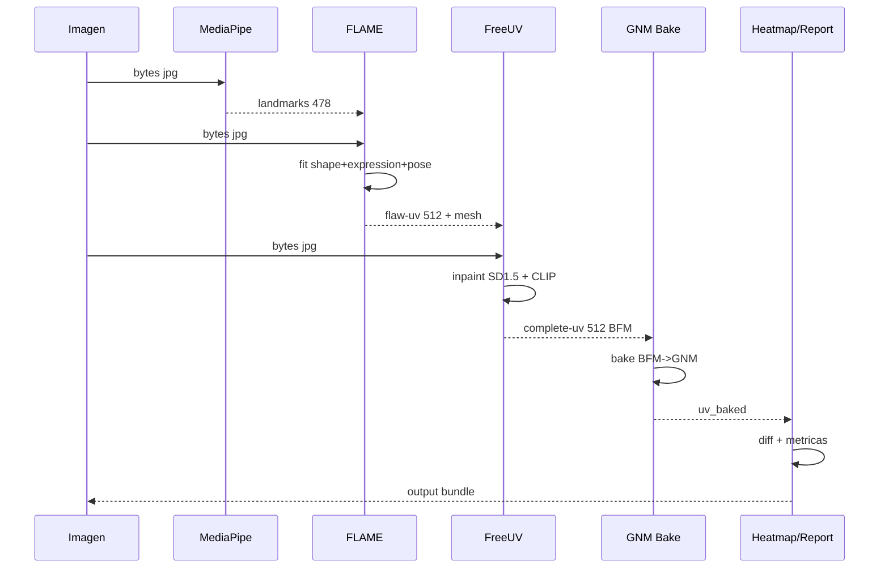
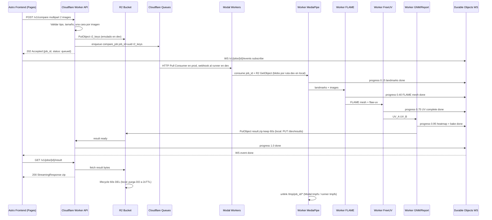

# PIPELINE - Flujo Completo Vultus

> Estado objetivo sin Rust ni API Python: gateway unico TS en `edge/`
> (prod `wrangler.toml`, dev `wrangler.dev.toml`), runner local Python en `backend/local_runner.py`
> (sink HTTP + timeouts 5s/10s/30s/total 60s=TTL), bake CPU en `backend/gnm.py`.
> Comandos nuevos: `pytest backend/tests/test_pipeline.py -q`, `bash scripts/smoke-fase0.sh`.

## 1. Resumen

Este documento describe el flujo end-to-end desde que el usuario sube 2 caras hasta que descarga el resultado.
El pipeline es asíncrono, stateless y sin persistencia.
En prod cada etapa es un worker en `Modal` que consume de `Cloudflare Queues` vía `HTTP Pull Consumer`; en dev el runner local consume la queue emulada vía webhook del consumer dev.

## 2. Diagrama de pipeline

> Infra prod: Cloudflare Pages + Workers + Queues + R2 + Durable Objects + Modal. Dev local: mismo worker con R2/Queue/DO emulados (`wrangler.dev.toml`) + runner webhook, sin `Redis`.

```mermaid
graph TD
    A[Cliente Astro - Cloudflare Pages Upload 2 jpgs] --> B[Worker POST /v1/compare (prod y dev)]
    B --> C{Validacion + R2 PutObject}
    C -->|ok| D["Enqueue {job_id, r2_keys} a Queues"]
    C -->|fail| E[400 Bad Request]
    D --> F[Runner local via webhook dev / Modal Worker 1 - MediaPipe 478 landmarks]
    F --> G[FLAME Fitting GPU]
    G --> H[FreeUV UV completo GPU]
    H --> I[GNM Bake + Heatmap + Report]
    I --> J[Result bytes TTL 60s (R2 prod / PUT dev local)]
    J --> K[Worker StreamingResponse zip]
    K --> L[Cliente descarga - UV_A UV_B heatmap mesh PDF]
    J -. lifecycle 60s .-> M[Olvido total - tmpfs wipe + R2 DEL + Queue 24h]
    D -. progress .-> N[Durable Objects WS /v1/jobs/id/events]
    N --> A
```

## 3. Secuencia de modelos

Esta sección muestra como se encadenan los 4 modelos y que dato produce cada uno.

```mermaid
graph LR
    I["Imagen 512x512"] --> M["MediaPipe<br/>Tasks Vision<br/>CPU 25ms"]
    M -->|"478 landmarks 3D"| F["FLAME Fitting<br/>3DDFA_V3 / DECA<br/>GPU 300ms"]
    F -->|"mesh 5023 verts + flaw-uv 512"| U["FreeUV<br/>SD1.5 + CLIP<br/>GPU 10s"]
    U -->|"complete-uv 512"| G["GNM Bake<br/>BFM->GNM<br/>CPU 150ms"]
    G -->|"mesh GNM 10k verts + textura horneada"| H["Heatmap + Report<br/>CPU 200ms"]
    H --> O["Salida: uv_a, uv_b, heatmap, mesh.glb, report.pdf"]

    style M fill:#e3f2fd
    style F fill:#fff3e0
    style U fill:#fce4ec
    style G fill:#e8f5e9
    style H fill:#f3e5f5
```



Dependencias por modelo:

- **MediaPipe** es entrada.
No depende de nadie.
Salida `landmarks 478` alimenta a FLAME.

- **FLAME Fitting** depende de `image + landmarks`.
Salida `mesh FLAME + flaw-uv` con huecos por oclusión.
Sin landmarks no puede estimar pose.

- **FreeUV** depende de `flaw-uv + image`.
Salida `complete-uv` sin huecos y con iluminación normalizada.
Es el cuello de botella y corre 2 veces en paralelo, una por cara.

- **GNM Bake** depende de `complete-uv` en topología BFM.
Hace transferencia baricéntrica a topología GNM.
Salida `mesh GNM` texturizado.

- **Heatmap + Report** depende de `complete-uv A y B` ya en mismo espacio canónico.
Calcula `|UV_A - UV_B|` y distancias antropométricas.



Paralelización:

- Cara A y cara B se procesan en paralelo en `MediaPipe -> FLAME -> FreeUV`.
- Cada cara usa su propio chain.
- `GNM Bake` y `Heatmap` esperan a que ambas ramas terminen y hacen join.

## 4. Secuencia detallada end-to-end



## 5. Etapas

### 5.1 Entrada - POST /v1/compare

El cliente envía `multipart/form-data` con `image_a` y `image_b`.
Cada imagen debe ser JPEG o PNG menor a 8MB (errores `SizeOutOfRange | UnsupportedFormat`).
Faltante o multipart roto es `400 {"detail":...}` sin encolar.
Si pasa, el worker encola `{job_id, r2_keys}` y retorna `202 {job_id, status:"queued"}`.
`GET /v1/jobs/{id}` valida uuid con `trim` y retorna `200 {job_id, status}`; uuid roto es `400`, desconocido es `404`. El `GET` lee el `ProgressDO /status` como fuente de verdad.

### 5.2 Queue - Cloudflare Queues + R2 (prod) / emulados (local)

El worker hace `R2 PutObject` con `image_a/b` y serializa solo `compare_job(job_id, r2_keys jobs/{id}/a|b)` (límite 128KB/mensaje, no caben 2x8MB).
`Cloudflare Queues` cobra `10k ops/día free` (write/read/delete = 3 ops por job -> ~3.333 jobs/día free), retención `24h` en free pero `TTL lógico 60s` (`TtlSecs` default 60) vía `Durable Object alarm` + `R2 lifecycle 60s`.
En local la misma entrada dev (`wrangler.dev.toml`) emula R2/Queue/DO y el consumer dev reenvia al webhook del runner.
Modal consume vía `HTTP Pull Consumer`. El progreso va por `Durable Objects WS` con `Stage::{queued, landmarks, flame, freeuv, bake, done}`.

No hay Postgres ni MinIO persistente. En prod el egress de R2 es free.

### 5.3 Worker 1 - MediaPipe 478 landmarks

Input: `&ImageBytes`.
Output: `Landmarks` (JSON `[[x,y,z],...]` 478 finitos, `LANDMARKS_LEN`).
Firma `MlSidecarClient::landmarks(&JobId, &ImageBytes) -> Landmarks` (`POST /ml/landmarks` con `X-Job-Id`, `BaseUrl::join`).
Runtime CPU, 20-30ms por cara.
Si el sidecar retorna stub `{"todo":...}` o largo wrong, `Landmarks::parse` falla con `Ml::Decode`.
Escribe landmarks a `/tmp/{job_id}/landmarks.json` en tmpfs.

### 5.4 Worker 2 - FLAME Fitting

Input: `&ImageBytes + &Landmarks`.
Output: `FlawUv` (`UV_LEN = 786432`).
Firma `MlSidecarClient::flame(&JobId, &ImageBytes, &Landmarks) -> FlawUv` con `FlamePayload::encode/decode` (`u32 BE len + landmarks_json + image_bytes`) sobre `POST /ml/flame`.
Runtime GPU con `3DDFA_V3` o `DECA`.
Estima `shape, expression, pose` y proyecta a `mesh` con `UV` de BFM.
Genera `flaw-uv` de 512x512 con huecos por oclusión.
Tiempo 200-400ms por cara en T4.

### 5.5 Worker 3 - FreeUV

Input: `&FlawUv` (`UV_LEN`).
Output: `CompleteUv` (`UV_LEN`).
Firma `MlSidecarClient::freeuv(&JobId, &FlawUv) -> CompleteUv` sobre `POST /ml/freeuv`.
Runtime GPU con `SD1.5 + CLIP`.
Hace inpainting de regiones ocluidas y normaliza iluminación.
Tiempo 8-12s por cara en T4.
Es la etapa más costosa.
`BaseUrl::parse` exige `http(s)://` y recorta `/`; payload vacío es `Ml::Empty`, status no-2xx es `Ml::BadStatus`, truncate es `Ml::Decode`.

### 5.6 Worker 4 - GNM Bake, Heatmap y Report

Input: `&CompleteUv` de ambas caras en topología BFM (`UV_LEN` ya probado).
Pasos: bake infallible `bake_bfm_to_gnm(&FlawUv) -> CompleteUv` (identidad Fase 0, matriz precomputada en Fase 2), `compute_heatmap(&CompleteUv, &CompleteUv) -> Heatmap` (`|a-b|` por byte, `expect` seguro porque ambas prueban `UV_LEN`), cálculo de distancias antropométricas normalizadas por interpupilar en UV canónico, generación de `report.pdf` con imágenes originales, UVs, heatmap y tabla de métricas con disclaimer.
Output: `uv_a.png, uv_b.png, heatmap.png, mesh_gnm.glb, report.pdf`.
Runtime CPU/GPU 300-500ms.
Todo se escribe a `/tmp/{job_id}/` y se retorna como dict de bytes.
Sin dep `image`; tipos `FlawUv` / `CompleteUv` / `Heatmap` cruzan el seam.

### 5.7 Entrega - GET /v1/jobs/{id}/result

El frontend pide el resultado tras recibir `WS done` (Durable Objects en prod y dev).
El Worker hace `R2 GetObject(job_id/result.zip)` y arma un `StreamingResponse` con `Content-Type: application/zip` y `Content-Disposition: attachment`.
El zip contiene `uv_a.png, uv_b.png, heatmap.png, mesh_a.glb, mesh_b.glb` en memoria, sin escribir a disco.
Tras el stream, en prod `R2 lifecycle 60s` borra solo y en local el DO purga a 2xTTL.
El frontend crea `URL.createObjectURL` para descarga y ofrece re-descarga local desde memoria sin volver al servidor.

### 5.8 Limpieza stateless

Cada worker hace `unlink` de `/tmp/{job_id}/*` al terminar, éxito o fallo.
Local: pipeline con `cleanup_job_dir` + DO TTL 60s con purga a 2xTTL automático. Prod: `R2 lifecycle 60s` + `Queue retención 24h` pero `TTL lógico 60s` vía `Durable Object alarm`.
Logs no contienen bytes de imagen, solo `job_id` y `duration_ms`.
Verificación: el pipeline inexorablemente limpia `tmpfs` (tests) y el DO expone `expired` visible antes de purgar. Sin `redis.exists`.

## 6. Contratos de datos

Job enqueue: `{job_id, r2_keys jobs/{id}/a|b}` en la queue (patrón `R2 pointer`, límite Queues 128KB).
Worker return tipado: `Landmarks -> FlawUv -> CompleteUv -> Heatmap` (cada `parse` exige forma, `Ml::Decode` si no).
`FlamePayload` es `u32 BE len + landmarks_json + image_bytes` para paridad.
Progress events WS: `{job_id, progress: Progress 0.0-1.0, stage: Stage queued|landmarks|flame|freeuv|bake|done}` vía `Durable Objects` en prod y dev.
Error HTTP: `400` validación (imagen, uuid, progreso, multipart), `404` desconocido, `500` infra con `{"detail":...}`.

## 7. Manejo de errores

Imagen inválida: `400 {"detail":...}` inmediato sin encolar (`InvalidImage`).
Faltante / multipart roto: `400` (`BadRequest`).
UUID roto: `400` (`InvalidJobId` con `trim`).
Job desconocido: `404` (`NotFound`).
No face / UV wrong / stub: `Ml::Decode` (500 infra, solo desde sidecar, nunca cliente directo).
Sidecar caído / status no-2xx / vacío: `Ml::{Transport, BadStatus, Empty}` (500 `internal error` al cliente, detalle en logs con `job_id`).
Invariante rota (`TtlSecs`, `assert_ok`): `Invariant` (500, pagina al dev).
Timeout: `job_timeout=30s` por etapa, `max 60s` total (`TtlSecs` default 60).
Cliente cierra pestaña: `Store` expira solo, sin leak.

## 8. Observabilidad

Métricas por job: `duration_ms` por etapa, `vram_mb`, `queue_lag_ms` (local `Store` / `Cloudflare Queues lag + Modal GPU util` prod).
Logs estructurados con `job_id` sin datos biométricos (Workers Logs 3 días free, Modal logs).
`app.py` con lifespan (reaper TTL/2) y logs con `job_id` + `duration_ms`, sin bytes.
Health: `GET /health` verifica `queue ping` (local `Store` / Queues health prod) y `gpu available` (local `nvidia-smi` / Modal `torch.cuda.is_available`). En prod `Cloudflare Analytics` + `OpenTelemetry` + `Sentry` si se configura.

## 9. Escalado

Local: Workers CPU y GPU escalan independiente vía `docker compose --scale`, `Store` tras `RLock` + `dict`.
Prod: `Cloudflare Workers` escala a 0 automático, `Modal` escala GPU `0 -> 100` (`Starter 10 GPU concurrency free`, `Team 50`), `1-2s` cold start, R2/Queues sin gestión. `FreeUV concurrency=1` por GPU para no OOM sigue vigente en Modal.
Sin storage persistente, no hay cuello de botella de I/O.
Cache opcional efímera `hash(image) -> UV` en R2 con TTL 60s (`TtlSecs`) si se quiere evitar recomputar misma cara en ventana corta, desactivada por defecto por stateless estricto.
