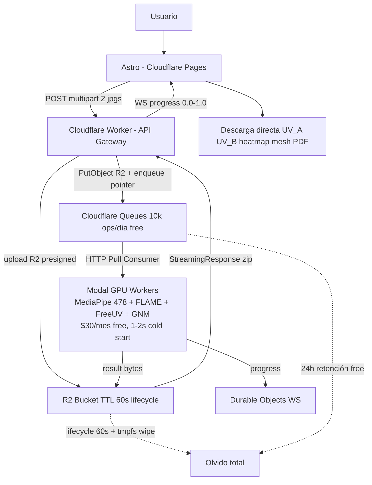

# ROADMAP - Vultus Comparador Visual Forense

## 1. Resumen

Vultus es un comparador visual forense en espacio canónico.
Normaliza 2 caras a un espacio UV y permite comparación pixel a pixel invariante a pose y expresión.
El sistema es stateless por diseño.
No persistimos imágenes ni resultados tras la entrega al cliente.
Toda la inferencia es asíncrona vía queues y workers.

## 2. Vision - Por que UV en espacio canónico

La comparación directa en espacio imagen con overlay y transparencia falla con diferencias de pose mayores a 15 grados y con distorsión de perspectiva.
Vultus compara en espacio UV canónico.
Cada foto se convierte en `mesh 3D -> unwrap -> UV 512x512`.
Esto permite heatmap de diferencia por región, normalización de iluminación y zoom sin distorsión.
La textura UV es la fuente de verdad para métricas antropométricas, no la foto original.

## 3. Arquitectura

### 3.1 Diagrama general stateless

> **Infra elegida: Cloudflare + Modal** (ADR-004). Edge serverless para API/queue/storage, GPU serverless para visión.



### 3.2 Principio stateless

No hay Postgres ni S3 persistente.
El worker escribe solo a `/tmp` en `tmpfs` (Docker local o Modal container).
En prod el resultado vive en `R2` `job_id/result.zip` solo 60 segundos (lifecycle rule) y el mensaje en `Cloudflare Queues` con retención 24h (free) pero `TTL lógico 60s` vía Durable Object alarm + `R2 EXPIRE`.
En dev se usa `Redis EXPIRE 60s` para paridad local vía adapter.
Tras la descarga el cliente es dueño de los archivos.
El servidor no recuerda nada.
Esto simplifica infra, reduce coste y es GDPR friendly.

### 3.3 Flujo de un job

El cliente sube 2 imágenes vía `POST /v1/compare` en `Cloudflare Pages -> Worker`.
El Worker valida, hace `R2 PutObject` con las 2 imágenes y encola solo `{job_id, r2_keys}` en `Cloudflare Queues` (Queues limita a 128KB por mensaje, no caben bytes). Retorna `202 + job_id` inmediato.
El frontend se suscribe a `WS /v1/jobs/{id}/events` vía `Durable Objects`.
Los workers en `Modal` consumen vía `HTTP Pull Consumer`, procesan `MediaPipe -> FLAME -> FreeUV -> GNM` y retornan bytes a `R2` con `lifecycle 60s`.
El Worker hace `await R2 GetObject(job_id/result.zip)` y responde con `StreamingResponse` zip en memoria.
`R2 lifecycle` hace `EXPIRE 60s` y el worker Modal hace `unlink` de `/tmp`.
En dev local el flujo es idéntico pero `Redis ARQ` sustituye a `Queues + R2` vía el mismo `core.queue` adapter.
Si el usuario cierra la pestaña antes de descargar, el resultado expira y debe reintentar.

## 4. Stack Tecnico

### 4.1 Backend híbrido Rust + Python ML

Rust gestionado con `cargo` en `backend/` workspace (`api`, `core`, `workers_cpu`).
Framework `Axum + tokio + serde + utoipa` para Seam 1.
Queue con trait `Queue` en `vultus-core` (`MemoryQueue` en tests, `Redis` local, `Queues+R2` prod).
Validación en bordes con `ImageBytes::parse`/`JobId`/`Progress` y `assert_ok` en core.
CPU: `vultus-workers-cpu` (`compute_heatmap`, `bake_bfm_to_gnm`).
ML GPU: sidecar Python en `backend/modal_app.py` (`MediaPipe Tasks Vision`, `3DDFA_V3 o DECA para FLAME`, `FreeUV`, `GNM Head`) tras `POST /ml/*`, consumido por `MlSidecarClient`. Rust nunca importa `torch`.

### 4.2 Frontend

Astro 4 con React Islands.
Three.js para visor 3D y visor UV plano.
Tailwind para estilos.
Comunicación `REST + WebSocket` contra FastAPI.

### 4.3 Infra

**Prod elegida: Cloudflare + Modal.**

- **Cloudflare Pages** para Astro frontend (static, free ilimitado).
- **Cloudflare Workers** para API Gateway (`POST /v1/compare`, `WS` vía Durable Objects) - `100k req/día free`, `Paid $5/mes` para `>10ms CPU`.
- **Cloudflare Queues** para `enqueue` (`10k ops/día free`, `24h retención free`) - reemplaza Redis ARQ en prod vía adapter.
- **Cloudflare R2** para storage temporal `job_id/result.zip` con `lifecycle 60s` - `10GB-mes + 1M Class A + 10M Class B free`, egress free - reemplaza Redis bytes.
- **Cloudflare Turnstile + WAF** para rate limiting y DDoS free.
- **Modal** para workers GPU (`FreeUV SD1.5 12GB`, `FLAME`) - `T4 $0.59/h`, `Starter $30/mes free` (~9.300 compares/mes gratis), cold start 1-2s, `HTTP Pull Consumer` desde Queues, `tmpfs` en container.
- **Docker Compose** solo para dev local: `api`, `worker-cpu`, `worker-gpu`, `frontend`, `redis` con paridad de contratos.
- `Dockerfile` multi-stage para backend con `uv`.
- `Dockerfile.gpu` basado en `nvidia/cuda:12.2-runtime` para workers GPU locales.
- `modal_app.py` para deploy GPU en Modal, `wrangler.toml` para deploy edge en Cloudflare.
- Sin `postgres` ni `minio` persistente por stateless.
- CI con `GitHub Actions + buildx + GHCR` + `wrangler deploy` + `modal deploy`.

## 5. Estructura de Proyecto

```
facium/
├── ROADMAP.md
├── CONTEXT.md
├── README.md
├── wrangler.toml              # Cloudflare Workers + Queues + R2 + Durable Objects (prod)
├── backend/
│   ├── pyproject.toml
│   ├── uv.lock
│   ├── modal_app.py           # Modal GPU workers: MediaPipe/FLAME/FreeUV/GNM (prod)
│   ├── Dockerfile
│   ├── Dockerfile.gpu
│   ├── app/
│   │   ├── api/
│   │   ├── workers/
│   │   ├── models/
│   │   └── core/queue.py      # Adapter: Redis ARQ (local/test) <-> Cloudflare Queues+R2 (prod)
│   └── tests/
│       ├── api/
│       └── workers/
└── frontend/
    ├── astro.config.mjs       # -> Cloudflare Pages en prod
    ├── src/
    └── e2e/
```

## 6. Fases

### Fase 0 - Infra base (1 semana)

Objetivo: `uv + Docker + Async` corriendo end-to-end con job dummy stateless con paridad Cloudflare.
Tasks: crear `pyproject.toml` con `uv`, `Dockerfile` multi-stage, `docker-compose.yml` con `api/redis/frontend` para dev local, configurar `core.queue` adapter `Redis ARQ` (local) / `Cloudflare Queues + R2` (prod) con `POST /v1/jobs` y `GET /v1/jobs/{id}` y `WS /v1/jobs/{id}/events` vía Durable Objects, implementar `wrangler.toml` y healthchecks.
Done: `uv run pytest` pasa, `docker compose up` levanta todo en local, `wrangler dev` levanta edge, un job fake se encola (Redis local o Queues en prod), es consumido por worker (local o Modal), retorna bytes a Redis/R2 y expira a los 60s sin dejar archivos en `/tmp`.

### Fase 1 - MVP UV canónico (3 semanas)

Objetivo: comparación en UV canónico sin GNM.
Tasks: Worker MediaPipe 478 en CPU, Worker FLAME fitting con `3DDFA_V3` o `DECA`, Worker FreeUV con `SD1.5 + CLIP`, orquestación `landmarks -> FLAME -> unwrap incompleto -> FreeUV -> UV completo 512x512`, API `POST /v1/compare` con 2 imágenes, frontend visor `UV_A | UV_B | heatmap diff` con slider de opacidad y normalización de pose.
Done: 10 pares con variación de pose 0-30 grados comparables sin distorsión, tiempo menor a 20s por par en GPU T4, heatmap `|UV_A - UV_B|` visible por región.

### Fase 2 - GNM Render 3D (2 semanas)

Objetivo: modelo 3D fotorrealista con textura UV horneada.
Tasks: integrar `google/GNM` `gnm/shape` como renderer, construir transferencia baricéntrica precomputada `BFM -> GNM`, Worker GNM bake `UV_BFM -> GNM`, visor Three.js 3D sincronizado con UV plano.
Done: misma comparación UV pero con visor 3D con ojos dientes y lengua, control de expresión neutra, textura sin costuras.

### Fase 3 - Metricas forenses (1 semana)

Objetivo: medición antropométrica sobre UV canónico.
Tasks: definir subset de 68 landmarks forenses, calcular distancias normalizadas por distancia interpupilar en UV, generar PDF report con disclaimer de no identificación automática, incluir imágenes originales, UVs, heatmap y tabla de métricas.
Done: `GET /v1/jobs/{id}/result` incluye `report.pdf` con métricas, valores verificados contra literales golden medidos manualmente.

### Fase 4 - Hardening (1 semana)

Objetivo: calidad y seguridad.
Tasks: rate limiting, validación de tipos de imagen y tamaño, borrado seguro verificado, tests E2E con Playwright, CI lint y typecheck, manejo de errores con `Result`.
Done: `docker compose -f docker-compose.prod.yml up` pasa E2E completo, ningún archivo persiste tras 65s, logs no contienen imágenes.

### Fase 5 - Produccion (1.5 semanas)

Objetivo: deploy reproducible y observable en Cloudflare + Modal.
Tasks: `Dockerfile.gpu` final, `tmpfs` para `/tmp` local y en Modal container, CI `buildx + GHCR` para local, `wrangler deploy` para `Cloudflare Pages (Astro) + Workers API + Queues + R2 + Durable Objects`, `modal deploy` para `Workers GPU` (`MediaPipe/FLAME/FreeUV/GNM`) con `HTTP Pull Consumer` desde `Cloudflare Queues`, `R2 lifecycle 60s` + `Queues retención 24h` + `alarm 60s`, observabilidad `Cloudflare Analytics + OpenTelemetry + Grafana + Sentry` para queue lag y VRAM, guardrails de borrado a 24h si se usa TTL extendido, smoke tests contra URL prod.
Done: `https://facium.com/compare` (Pages + Workers) corre vuelta completa menor a 20s, autoescala GPU en Modal por uso, coste estimado **$5/mes (Cloudflare Workers Paid) + $0 GPU hasta 9.300 compares/mes (Modal $30 free)** y luego `$0.0032` por compare T4.

## 7. Deployment - Opciones evaluadas

**Opción elegida: Cloudflare + Modal (híbrida serverless)**

`Astro en Cloudflare Pages + Workers API + Queues + R2 + Durable Objects + Workers GPU en Modal via HTTP Pull Consumer`.
Ventaja: edge global con 0 egress (R2), queue serverless, GPU pago por segundo, cold start Modal 1-2s vs 5-10s de Fly/RunPod, stateless con R2 lifecycle 60s.
Coste: **$5/mes Workers Paid + $0 GPU hasta 9k compares (Modal $30 free/mes)**, luego `$0.0032/compare` T4. Pages/Queues/R2 free tiers cubren free tier completo.

Opción B VPS soberano (alternativa GDPR): `Hetzner CCX con GPU + Dokploy o Coolify` todo en un host con `docker compose`.
Ventaja: datos no salen de tu servidor, ideal para GDPR forense estricto.
Coste: 40-90 usd mes fijo.

Opción C cloud nativo: `GCP Cloud Run + Cloud Run GPU L4 + Memorystore + Cloud SQL`.
Ventaja: autoescala real y compliance EU completo.
Coste: 80-200 usd mes.

Opción previa descartada: `Vercel + Fly.io + Upstash Redis` - más cara ($25-60 fijo) y con egress, reemplazada por Cloudflare free tier.

Default del roadmap: **Cloudflare + Modal** con B como alternativa GDPR.
El principio stateless + R2 lifecycle hace que cualquier opción sea más barata al no pagar storage persistente.

## 8. TDD - Seams y reglas

### 8.1 Seams acordados

Seam 1 HTTP API: `POST /v1/compare`, `GET /v1/jobs/{id}`, `WS /v1/jobs/{id}/events`.
Seam 2 Queue Contract: `enqueue -> job_id` y `worker consume -> progress`.
Seam 3 Worker Contract: `image bytes -> {uv bytes, mesh bytes, landmarks}`.
No son seams: `fit_flame`, `bake_bfm_to_gnm`, `project_uv`.
Se testean indirectamente vía Seam 3.

### 8.2 Anti-patrones a evitar

No mockear colaboradores internos.
No recomputar esperado con la misma pipeline.
No hacer horizontal slicing de todos los modelos antes de tener API.
Mock solo en boundaries externos: Redis, tiempo, filesystem efímero.
Usar inyección de dependencias para `uv_client` y `storage`.

### 8.3 Vertical slices

Cada fase avanza como `1 seam, 1 test RED, 1 implementación mínima GREEN`.
Ejemplo Fase 0: `test_create_job_returns_202` en Seam 1 antes de implementar worker real.
Ejemplo Fase 1: `test_frontal_face_produces_512_uv` en Seam 3 con `golden_frontal.jpg` y `assert uv.shape == (512,512,3)`.
Ejemplo stateless: `test_compare_does_not_persist_after_delivery` verifica `redis.exists == 0` tras 65s y `tmpfs` vacío.

## 9. Riesgos y mitigaciones

FreeUV requiere 12GB VRAM y 8-15s por cara.
Mitigación: serverless GPU con cache efímera opcional `hash(image) -> UV` si el cliente acepta retención de 60s.
GNM no trae encoder `imagen -> params`.
Mitigación: usar FLAME para extracción y GNM solo como renderer vía bake.
FreeUV espera topología BFM no GNM.
Mitigación: transferencia baricéntrica precomputada.
Sin storage no hay re-descarga.
Mitigación: frontend guarda zip en memoria y ofrece re-descarga local sin llamar al servidor.

## 10. Proximos pasos

Confirmar ROADMAP y CONTEXT.
Scaffold Fase 0 con `uv` y `docker-compose`.
Implementar tracer bullet `Seam 1` con job dummy.
Iterar Fase 1 con golden images verificadas manualmente.
