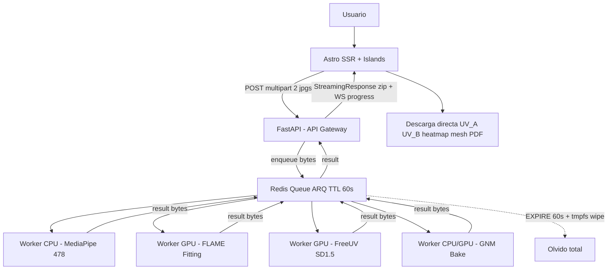

# ROADMAP - Vultus Comparador Visual Forense

## 1. Resumen

Vultus es un comparador visual forense en espacio canónico.
Normaliza 2 caras a un espacio UV y permite comparación pixel a pixel invariante a pose y expresión.
El sistema es stateless por diseño.
No persistimos imágenes ni resultados tras la entrega al cliente.
Toda la inferencia es asíncrona vía queues y workers.

## 2. Vision - Por que UV en espacio canónico

La comparación directa en espacio imagen con overlay y transparencia falla con diferencias de pose mayores a 15 grados y con distorsión de perspectiva.
Vultus compara en espacio UV canónico.
Cada foto se convierte en `mesh 3D -> unwrap -> UV 512x512`.
Esto permite heatmap de diferencia por región, normalización de iluminación y zoom sin distorsión.
La textura UV es la fuente de verdad para métricas antropométricas, no la foto original.

## 3. Arquitectura

### 3.1 Diagrama general stateless



### 3.2 Principio stateless

No hay Postgres ni MinIO ni S3.
El worker escribe solo a `/tmp` en `tmpfs`.
El resultado vive en Redis `job_id -> bytes` solo 60 segundos.
Tras la descarga el cliente es dueño de los archivos.
El servidor no recuerda nada.
Esto simplifica infra, reduce coste y es GDPR friendly.

### 3.3 Flujo de un job

El cliente sube 2 imágenes vía `POST /v1/compare`.
El API encola el job y retorna `202 + job_id` inmediato.
El frontend se suscribe a `WS /v1/jobs/{id}/events` para progreso.
Los workers consumen de Redis, procesan y retornan bytes a Redis con `keep_result=60`.
El API hace `await queue.result(job_id)` y responde con `StreamingResponse` zip en memoria.
Redis hace `EXPIRE 60` y el worker hace `unlink` de `/tmp`.
Si el usuario cierra la pestaña antes de descargar, el resultado expira y debe reintentar.

## 4. Stack Tecnico

### 4.1 Backend Python

Python 3.12 gestionado con `uv`.
Dependencias declaradas en `pyproject.toml` con `uv.lock` y `uv sync --frozen`.
Framework `FastAPI + Pydantic` para API.
Queue `Redis + ARQ` nativo asyncio, más ligero que Celery.
Validación en bordes con `Result` y `assert_ok` en core.
Modelos: `MediaPipe Tasks Vision`, `3DDFA_V3 o DECA para FLAME`, `FreeUV`, `GNM Head`.

### 4.2 Frontend

Astro 4 con React Islands.
Three.js para visor 3D y visor UV plano.
Tailwind para estilos.
Comunicación `REST + WebSocket` contra FastAPI.

### 4.3 Infra

Docker Compose para todos los servicios.
`Dockerfile` multi-stage para backend con `uv`.
`Dockerfile.gpu` basado en `nvidia/cuda:12.2-runtime` para workers GPU.
Servicios `api`, `worker-cpu`, `worker-gpu`, `frontend`, `redis`.
Sin `postgres` ni `minio` por stateless.
CI con `GitHub Actions + buildx + GHCR`.

## 5. Estructura de Proyecto

```
facium/
├── ROADMAP.md
├── CONTEXT.md
├── README.md
├── docker-compose.yml
├── docker-compose.prod.yml
├── backend/
│   ├── pyproject.toml
│   ├── uv.lock
│   ├── Dockerfile
│   ├── Dockerfile.gpu
│   ├── app/
│   │   ├── api/
│   │   ├── workers/
│   │   ├── models/
│   │   └── core/
│   └── tests/
│       ├── api/
│       └── workers/
└── frontend/
    ├── astro.config.mjs
    ├── src/
    └── e2e/
```

## 6. Fases

### Fase 0 - Infra base (1 semana)

Objetivo: `uv + Docker + Async` corriendo end-to-end con job dummy stateless.
Tasks: crear `pyproject.toml` con `uv`, `Dockerfile` multi-stage, `docker-compose.yml` con `api/redis/frontend`, configurar `ARQ` con `POST /v1/jobs` y `GET /v1/jobs/{id}` y `WS /v1/jobs/{id}/events`, implementar healthchecks.
Done: `uv run pytest` pasa, `docker compose up` levanta todo, un job fake se encola en Redis, es consumido por worker, retorna bytes y expira a los 60s sin dejar archivos en `/tmp`.

### Fase 1 - MVP UV canónico (3 semanas)

Objetivo: comparación en UV canónico sin GNM.
Tasks: Worker MediaPipe 478 en CPU, Worker FLAME fitting con `3DDFA_V3` o `DECA`, Worker FreeUV con `SD1.5 + CLIP`, orquestación `landmarks -> FLAME -> unwrap incompleto -> FreeUV -> UV completo 512x512`, API `POST /v1/compare` con 2 imágenes, frontend visor `UV_A | UV_B | heatmap diff` con slider de opacidad y normalización de pose.
Done: 10 pares con variación de pose 0-30 grados comparables sin distorsión, tiempo menor a 20s por par en GPU T4, heatmap `|UV_A - UV_B|` visible por región.

### Fase 2 - GNM Render 3D (2 semanas)

Objetivo: modelo 3D fotorrealista con textura UV horneada.
Tasks: integrar `google/GNM` `gnm/shape` como renderer, construir transferencia baricéntrica precomputada `BFM -> GNM`, Worker GNM bake `UV_BFM -> GNM`, visor Three.js 3D sincronizado con UV plano.
Done: misma comparación UV pero con visor 3D con ojos dientes y lengua, control de expresión neutra, textura sin costuras.

### Fase 3 - Metricas forenses (1 semana)

Objetivo: medición antropométrica sobre UV canónico.
Tasks: definir subset de 68 landmarks forenses, calcular distancias normalizadas por distancia interpupilar en UV, generar PDF report con disclaimer de no identificación automática, incluir imágenes originales, UVs, heatmap y tabla de métricas.
Done: `GET /v1/jobs/{id}/result` incluye `report.pdf` con métricas, valores verificados contra literales golden medidos manualmente.

### Fase 4 - Hardening (1 semana)

Objetivo: calidad y seguridad.
Tasks: rate limiting, validación de tipos de imagen y tamaño, borrado seguro verificado, tests E2E con Playwright, CI lint y typecheck, manejo de errores con `Result`.
Done: `docker compose -f docker-compose.prod.yml up` pasa E2E completo, ningún archivo persiste tras 65s, logs no contienen imágenes.

### Fase 5 - Produccion (1.5 semanas)

Objetivo: deploy reproducible y observable.
Tasks: `Dockerfile.gpu` final, `docker-compose.prod.yml` con `tmpfs` para `/tmp`, CI `buildx` y push a `GHCR`, deploy híbrido `Vercel para Astro + Fly.io para API + Modal o RunPod Serverless para Workers GPU + Upstash Redis EU`, observabilidad `OpenTelemetry + Grafana + Sentry` para queue lag y VRAM, guardrails de borrado a 24h si se usa TTL extendido, smoke tests contra URL prod.
Done: `https://facium.com/compare` corre vuelta completa menor a 20s, autoescala GPU por uso, coste estimado 25-60 usd mes más GPU por segundo.

## 7. Deployment - Opciones evaluadas

Opción A híbrida recomendada para MVP: `Astro en Vercel + FastAPI en Fly.io AMS + Workers GPU en Modal o RunPod Serverless + Upstash Redis EU`.
Ventaja: pago por segundo de GPU, cold start 5-10s aceptable en forense.
Coste: 25-60 usd mes más uso GPU.

Opción B VPS soberano: `Hetzner CCX con GPU + Dokploy o Coolify` todo en un host con `docker compose`.
Ventaja: datos no salen de tu servidor, ideal para GDPR forense.
Coste: 40-90 usd mes fijo.

Opción C cloud nativo: `GCP Cloud Run + Cloud Run GPU L4 + Memorystore + Cloud SQL`.
Ventaja: autoescala real y compliance EU completo.
Coste: 80-200 usd mes.

Default del roadmap: Opción A con B como alternativa GDPR.
El principio stateless hace que cualquier opción sea más barata al no pagar storage.

## 8. TDD - Seams y reglas

### 8.1 Seams acordados

Seam 1 HTTP API: `POST /v1/compare`, `GET /v1/jobs/{id}`, `WS /v1/jobs/{id}/events`.
Seam 2 Queue Contract: `enqueue -> job_id` y `worker consume -> progress`.
Seam 3 Worker Contract: `image bytes -> {uv bytes, mesh bytes, landmarks}`.
No son seams: `fit_flame`, `bake_bfm_to_gnm`, `project_uv`.
Se testean indirectamente vía Seam 3.

### 8.2 Anti-patrones a evitar

No mockear colaboradores internos.
No recomputar esperado con la misma pipeline.
No hacer horizontal slicing de todos los modelos antes de tener API.
Mock solo en boundaries externos: Redis, tiempo, filesystem efímero.
Usar inyección de dependencias para `uv_client` y `storage`.

### 8.3 Vertical slices

Cada fase avanza como `1 seam, 1 test RED, 1 implementación mínima GREEN`.
Ejemplo Fase 0: `test_create_job_returns_202` en Seam 1 antes de implementar worker real.
Ejemplo Fase 1: `test_frontal_face_produces_512_uv` en Seam 3 con `golden_frontal.jpg` y `assert uv.shape == (512,512,3)`.
Ejemplo stateless: `test_compare_does_not_persist_after_delivery` verifica `redis.exists == 0` tras 65s y `tmpfs` vacío.

## 9. Riesgos y mitigaciones

FreeUV requiere 12GB VRAM y 8-15s por cara.
Mitigación: serverless GPU con cache efímera opcional `hash(image) -> UV` si el cliente acepta retención de 60s.
GNM no trae encoder `imagen -> params`.
Mitigación: usar FLAME para extracción y GNM solo como renderer vía bake.
FreeUV espera topología BFM no GNM.
Mitigación: transferencia baricéntrica precomputada.
Sin storage no hay re-descarga.
Mitigación: frontend guarda zip en memoria y ofrece re-descarga local sin llamar al servidor.

## 10. Proximos pasos

Confirmar ROADMAP y CONTEXT.
Scaffold Fase 0 con `uv` y `docker-compose`.
Implementar tracer bullet `Seam 1` con job dummy.
Iterar Fase 1 con golden images verificadas manualmente.
