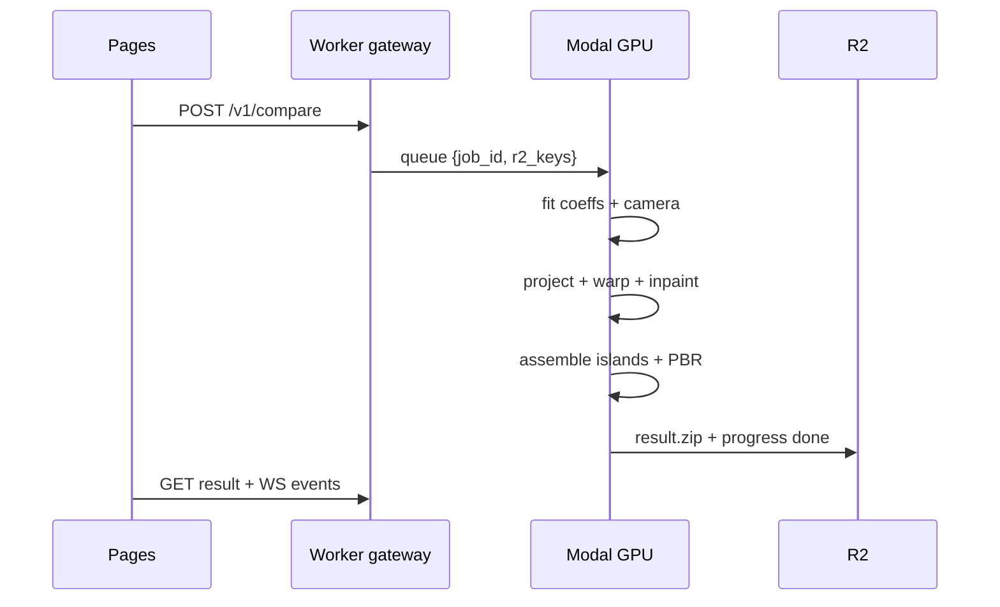
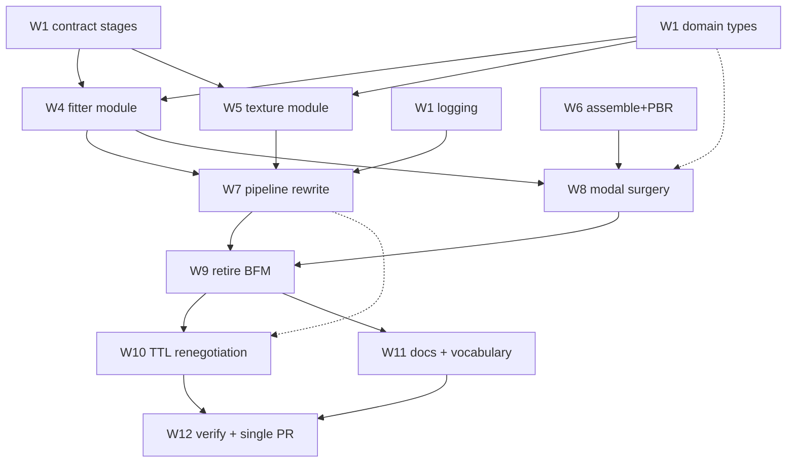
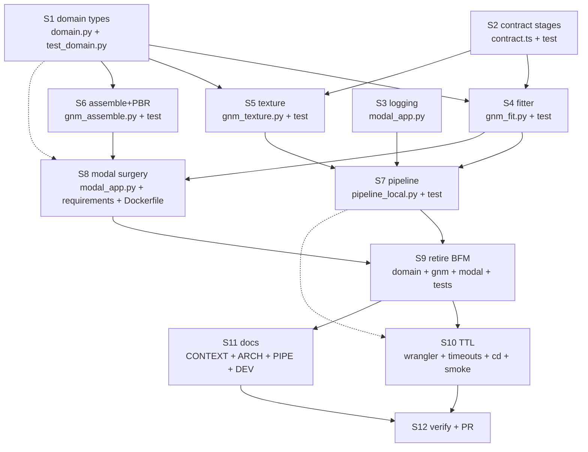

# Plan: gnm-fit-texture-pbr

> Generated: 2026-09-08 | Base commit: bef18c0 | Branch for work: feat/gnm-fit-texture-pbr (new, from main) | Delivery: one single PR to main, then promotion main into production via separate release PR.

## Required skills

| Skill | Path | Why |
|-------|------|-----|
| good-python | .agents/skills/good-python/SKILL.md | New domain types and Result railway in backend/domain.py and new gnm modules. |
| good-typescript | .agents/skills/good-typescript/SKILL.md | Stage brands, milestones and zip manifest in edge/contract.ts. |
| tdd | .agents/skills/tdd/SKILL.md | Seam-first vertical slices with the golden LFW pair. |
| bloodhound-antipatterns | .agents/skills/bloodhound-antipatterns/SKILL.md | Kill God Object and Lava Flow, avoid reintroducing smells. |
| coding-guide | .agents/skills/coding-guide/SKILL.md | Surgical changes, simplicity, goal-driven verification. |
| e2e | .agents/skills/e2e/SKILL.md | Pool suite, smoke-prod.sh and browser validation conventions. |
| modal | .agents/skills/modal/SKILL.md | Image recipe, secrets, volumes and deploy for the GNM worker image. |

> If any path above is missing at session start, read the closest match under that skill folder and note the substitution.

---

## Docs for Humans

### Problem Statement

The production 3D mesh is always the same static template with a blurry texture smeared on it.
It does not look like the GNM paper results because geometry is never personalized: DECA shape parameters are discarded after the flaw-UV render and no shape data crosses any seam.
The UV texture is washed out by accumulated downscaling plus a cut-down 12-step inpaint that generates the whole face instead of only occluded areas.

### Solution


Replace the DECA, FreeUV and LUT-bake chain with direct GNM fitting, photo projection with landmark warping, inpainting of occluded areas only, assembly into the 5 GNM UV islands plus PBR maps, and a redefined compare metric over identity coefficients plus texture difference.
Gateway, queue pattern, progress sink, Pages and CD stay untouched.



### User Stories

1. As a forensic analyst, I want the 3D mesh shaped like the photographed person, so that the comparison reflects identity instead of a shared template.
2. As a forensic analyst, I want UV texture projected from the real photo, so that skin detail is evidence instead of hallucination.
3. As a forensic analyst, I want eyes, teeth and mouth rendered from their own GNM islands, so that those regions stop smearing.
4. As a forensic analyst, I want a compare score from identity coefficients plus texture difference, so that same-person pairs score strictly below different-person pairs.
5. As a forensic analyst, I want PBR maps in the result bundle, so that relighting review is possible.
6. As a pipeline operator, I want per-stage duration and quality telemetry in Modal logs, so that regressions are attributable to a stage.
7. As a pipeline operator, I want TTL and timeouts derived from measured fit p95, so that slow fits fail loudly instead of expiring silently.
8. As a frontend user, I want the same upload and progress flow, so that no retraining on the UI is needed.
9. As a frontend user, I want the viewers to show the personalized mesh and island albedo, so that results look like the GNM paper.
10. As a release manager, I want the whole migration in one PR to main with green CI, so that promotion to production stays a clean merge.
11. As a QA engineer, I want frozen golden vectors for coefficients and textures, so that quality cannot degrade silently.
12. As a QA engineer, I want faceless inputs still rejected at the fit stage, so that validation behavior is preserved.

### Implementation Decisions

- The missing seam `FitResult { coeffs, camera }` between fit and texture is the core deepening; everything else follows from it.
- `modal_app.py` splits into three deep modules with narrow seams: fitter, texture, assemble. Delegation only, no logic left behind except the image recipe and function wiring.
- The BFM path is deleted, not deprecated: template asset, LUT asset, bake tables, flame and freeuv endpoints, flame payload codec.
- Compare becomes coefficient distance plus albedo difference; the heatmap survives with the new inputs.
- Zip keeps mesh, albedo and heatmap filenames unless a conflict forces versioning; the manifest in `edge/contract.ts` is the single source Python mirrors.
- PBR maps are generated from albedo in the assemble module and ride the same zip.
- TTL grows from measured fit p95; every timeout constant and the CD smoke SLO move together in one step.
- `compare-client.ts` needs no change: stage names render as opaque strings (verified in code).



File-conflict analysis: no two parallel steps share a file (matrix in Agent Instructions proves it with grep).
`modal_app.py` is touched in Waves 1, 3 and 4 but in strictly sequential waves.
`domain.py` is touched in Waves 1 and 4, sequential.
`pipeline_local.py` is touched in Waves 3 and 5, sequential.

### Testing Decisions

- Good tests verify behavior through seams with independent goldens: frozen coefficient vectors and frozen albedo bytes from the LFW golden pair, never recomputed by the code under test.
- Tested modules: domain types, fitter, texture, assemble, pipeline orchestration, contract stages, modal compat.
- Prior art: `backend/tests/test_pipeline.py` sink-in-memory pattern, `backend/tests/test_gnm.py` golden style, `edge/contract.test.ts` brand tests, `frontend/e2e/fixtures/README.md` golden pair.

### Out of Scope

- Ocular and intra-oral submodel research beyond the public GNM islands.
- Video or multi-photo fitting; single photo per face stays.
- Changes to gateway, queue pattern, sink protocol, Pages, CD flow and secrets.
- PBR viewer support beyond shipping the maps in the zip.
- Rebuilding the GNM fitter itself; the public fitter is assumed available.

### Further Notes

- The golden LFW pair hashes are frozen in `frontend/e2e/fixtures/README.md` and must not change.
- The biggest residual risk is fit p95 on T4 exceeding any reasonable TTL; Step 4 carries a timing gate for exactly this.
- `docs/.gitignore` already allows `plan-*.md` so this file is committable.

---

## Agent Instructions

> This section is for the agent executing the implementation.
> Read the skill files listed above before starting.

### Context to load first

- Skill files listed above.
- `backend/domain.py`, `backend/pipeline_local.py`, `backend/gnm.py`, `backend/modal_app.py` (read before editing).
- `edge/contract.ts`, `edge/contract.test.ts`, `frontend/src/components/compare-client.ts`.
- `backend/tests/test_pipeline.py` and `backend/tests/test_gnm.py` as style reference.
- `frontend/e2e/fixtures/README.md` for the golden pair hashes.
- Key types: `GnmCoeffs`, `CameraParams`, `UvRegion`, `FittedMesh`, `FitResult`, `ProgressSink`, `CompareResult`.
- Existing tests as pattern reference (see Testing Decisions).

**Do NOT:**

- Modify files outside those listed.
- Refactor unrelated code.
- Assume conventions that are not present in the codebase.

### If an instruction cannot be executed as written

1. Do NOT improvise an alternative silently.
2. If the mismatch is trivial (e.g. a slightly different file path), adapt, continue, and note it.
3. Otherwise stop, report the discrepancy, and ask how to proceed.

### Project commands

| Purpose | Command |
|---------|---------|
| Python tests | `python3 -m pytest backend/tests -q` |
| Python typecheck | `mypy --strict --explicit-package-bases --namespace-packages backend/domain.py backend/gnm.py backend/pipeline_local.py backend/local_runner.py backend/gnm_fit.py backend/gnm_texture.py backend/gnm_assemble.py` |
| Python lint | `ruff check backend/` |
| TS contract tests | `npx vitest run ../edge/contract.test.ts --root ..` (from `frontend/`) |
| Pool suite | `npx vitest run --config vitest.pool.config.ts` (from `frontend/`) |
| Edge dry-run | `npx --yes wrangler@4 deploy --dry-run --env production` |
| Prod smoke | `API_URL=https://api.vultus.esau.com.mx bash scripts/smoke-prod.sh` |

> Baseline at plan base commit: pytest 18 passed, mypy strict clean, ruff clean, vitest 7 passed, wrangler dry-run green. All commands above were run once and work.

### Execution strategy

| Strategy | Value |
|----------|-------|
| Mode | parallel |
| Max parallelism | 3 workers |
| Isolation | shared-branch (`feat/gnm-fit-texture-pbr`, one single PR to main) |

### Dependency graph



Dashed edges are file-conflict edges resolved by sequential waves, not data dependencies.

### File conflict matrix

| File | Wave 1 | Wave 2 | Wave 3 | Wave 4 | Wave 5 | Conflict? |
|------|--------|--------|--------|--------|--------|-----------|
| backend/domain.py | S1 | - | - | S9 | - | No, sequential waves |
| backend/tests/test_domain.py | S1 | - | - | S9 | - | No, sequential waves |
| edge/contract.ts | S2 | - | - | - | - | No, isolated |
| edge/contract.test.ts | S2 | - | - | - | - | No, isolated |
| backend/modal_app.py | S3 | - | S8 | S9 | S10 | No, sequential waves |
| backend/gnm_fit.py (new) | - | S4 | - | - | - | No, isolated |
| backend/tests/test_gnm_fit.py (new) | - | S4 | - | - | - | No, isolated |
| backend/gnm_texture.py (new) | - | S5 | - | - | - | No, isolated |
| backend/tests/test_gnm_texture.py (new) | - | S5 | - | - | - | No, isolated |
| backend/gnm_assemble.py (new) | - | S6 | - | - | - | No, isolated |
| backend/tests/test_gnm_assemble.py (new) | - | S6 | - | - | - | No, isolated |
| backend/pipeline_local.py | - | - | S7 | - | S10 | No, sequential waves |
| backend/tests/test_pipeline.py | - | - | S7 | S9 | - | No, sequential waves |
| backend/requirements.txt | - | - | S8 | - | - | No, isolated |
| backend/Dockerfile.gpu | - | - | S8 | - | - | No, isolated |
| backend/gnm.py | - | - | - | S9 | - | No, isolated |
| backend/tests/test_gnm.py | - | - | - | S9 | - | No, isolated |
| wrangler.toml | - | - | - | - | S10 | No, isolated |
| .github/workflows/cd.yml | - | - | - | - | S10 | No, isolated |
| scripts/smoke-prod.sh | - | - | - | - | S10 | No, isolated |
| .env.example | - | - | - | - | S10 | No, isolated |
| CONTEXT.md | - | - | - | - | S11 | No, isolated |
| ARCHITECTURE.md | - | - | - | - | S11 | No, isolated |
| PIPELINE.md | - | - | - | - | S11 | No, isolated |
| DEVELOPMENT.md | - | - | - | - | S11 | No, isolated |

> Verify with grep on the Files column: no wave has the same file in two of its steps.

### Waves

| Wave | Steps | Parallelizable | Depends on | Sub-agent assignment | Barrier guardrail |
|------|-------|----------------|------------|----------------------|-------------------|
| 1 | S1, S2, S3 | yes (3 lanes) | - | `general` x3 | mypy strict + vitest green per lane |
| 2 | S4, S5, S6 | yes (3 lanes) | Wave 1 | `general` x3 | pytest new tests green, fit p95 timing gate recorded |
| 3 | S7, S8 | yes (2 lanes) | Wave 2 | `general` x2 | pytest + modal_compat green, shared endpoint contract matches |
| 4 | S9 | no | Wave 3 | `general` | pytest + mypy + ruff green, zero BFM references via grep |
| 5 | S10, S11 | yes (2 lanes) | Wave 4 | `general` x2 | wrangler dry-run both envs green, smoke vs dev green |
| 6 | S12 | no | Wave 5 | coordinator (no sub-agent) | full loops green, single PR open to main |

### Context to load per wave

- Wave 1 Lane A (S1): `backend/domain.py`, `backend/tests/test_domain.py`, types `Ok`, `Err`, `DomainError`, example golden test.
- Wave 1 Lane B (S2): `edge/contract.ts`, `edge/contract.test.ts`, stage brand pattern.
- Wave 1 Lane C (S3): `backend/modal_app.py` logging block only.
- Wave 2 Lane A (S4): new `backend/gnm_fit.py`, Wave 1 `GnmCoeffs`/`CameraParams` types, golden LFW hashes.
- Wave 2 Lane B (S5): new `backend/gnm_texture.py`, Wave 1 `UvRegion` type, golden albedo bytes.
- Wave 2 Lane C (S6): new `backend/gnm_assemble.py`, 5-island layout version, golden GLB parse check.
- Wave 3 Lane A (S7): `backend/pipeline_local.py`, `ProgressSink` protocol, `test_pipeline.py` sink pattern.
- Wave 3 Lane B (S8): `backend/modal_app.py`, `.agents/skills/modal/SKILL.md`, endpoint contract from Wave 1/2.
- Shared after Wave 3 barrier: endpoint paths and payload shapes, integration tests.
- Wave 4 (S9): deletion list (template asset, LUT asset, bake tables, flame/freeuv endpoints, flame payload codec).
- Wave 5 Lane A (S10): `wrangler.toml`, `PipelineConfig`, modal timeouts, `cd.yml`, `smoke-prod.sh`.
- Wave 5 Lane B (S11): `CONTEXT.md` vocabulary, architecture docs.
- Shared after Wave 5 barrier: full test suite, dev-stack smoke, golden compare margin.

### Implementation steps

| # | Step | Files | Guardrail |
|---|------|-------|-----------|
| 1 | Add GnmCoeffs (253 finite floats), CameraParams, UvRegion islands 1-5, FittedMesh, FitFailed/InvalidCoeffs/InvalidCamera errors plus fit-request codec; extend domain tests | backend/domain.py, backend/tests/test_domain.py | mypy strict clean, pytest green |
| 2 | Replace STAGES with queued/fit/texture/assemble/done, mirror progress milestones, version the zip manifest with island and PBR names; extend contract tests | edge/contract.ts, edge/contract.test.ts | vitest green |
| 3 | Enable INFO logging in modal_app; no logic change | backend/modal_app.py | `modal app logs` shows stage lines on next deploy (or code review confirms basicConfig) |
| 4 | New fitter module wrapping the public GNM fitter with deterministic doubles fallback and Result railway; golden coefficient vector test on the LFW pair; record fit p95 on T4 as the TTL gate | backend/gnm_fit.py (new), backend/tests/test_gnm_fit.py (new) | pytest green, p95 recorded and inside renegotiated TTL or spike stops here |
| 5 | New texture module: projection plus TPS warp plus inpaint of occluded areas only; golden albedo bytes test | backend/gnm_texture.py (new), backend/tests/test_gnm_texture.py (new) | pytest green |
| 6 | New assemble module: 5-island layout plus PBR maps plus GLB export; GLB-parse and island-presence tests | backend/gnm_assemble.py (new), backend/tests/test_gnm_assemble.py (new) | pytest green |
| 7 | Rewrite run_pair stages and timeouts around S4-S6 with A/B parallelism kept; update pipeline tests to the new stages | backend/pipeline_local.py, backend/tests/test_pipeline.py | pytest green |
| 8 | Split modal_app into delegates for the new modules, add new /ml endpoints, pin GNM deps and weights recipe | backend/modal_app.py, backend/requirements.txt, backend/Dockerfile.gpu | modal_compat tests green, image builds |
| 9 | Delete the BFM path: template and LUT assets references, bake tables, flame/freeuv endpoints, flame payload codec, stale tests; rewrite gnm tests | backend/gnm.py, backend/domain.py, backend/modal_app.py, backend/tests/test_gnm.py, backend/tests/test_domain.py, backend/tests/test_pipeline.py | pytest + mypy + ruff green, grep for bfm/flaw/freeuv/flame returns only historical docs |
| 10 | Renegotiate TTL from measured p95 across wrangler vars, PipelineConfig, modal and queue timeouts, cd timeouts, smoke SLO and env example | wrangler.toml, wrangler.dev.toml, backend/pipeline_local.py, backend/modal_app.py, .github/workflows/cd.yml, scripts/smoke-prod.sh, .env.example | wrangler dry-run both envs green, smoke vs dev green |
| 11 | Update domain vocabulary and architecture, pipeline and development docs | CONTEXT.md, ARCHITECTURE.md, PIPELINE.md, DEVELOPMENT.md | docs name only new stages and types |
| 12 | Run all loops, verify golden A/A vs A/B margin, open the single PR to main | all touched | completion checklist below green, one PR open |

### Evals

| Step | Eval | Type | Command | Run after |
|------|------|------|---------|-----------|
| 1 | Frozen types reject 252/254-length vectors and non-finite floats | unit | `python3 -m pytest backend/tests/test_domain.py -q` | Wave 1 barrier |
| 2 | Unknown stage rejected, manifest lists island and PBR names | unit | `npx vitest run ../edge/contract.test.ts --root ..` | Wave 1 barrier |
| 3 | Stage log line format present | unit | code review of the logging hunk | Wave 1 barrier |
| 4 | LFW pair yields frozen coefficient vector; fit p95 inside TTL | integration | `python3 -m pytest backend/tests/test_gnm_fit.py -q` | Wave 2 barrier |
| 5 | LFW pair yields frozen albedo bytes with real-photo detail | integration | `python3 -m pytest backend/tests/test_gnm_texture.py -q` | Wave 2 barrier |
| 6 | GLB parses, 5 islands present, PBR maps in zip | integration | `python3 -m pytest backend/tests/test_gnm_assemble.py -q` | Wave 2 barrier |
| 7 | A/B parallel pair completes through the memory sink with new stages | integration | `python3 -m pytest backend/tests/test_pipeline.py -q` | Wave 3 barrier |
| 8 | Local doubles and Modal real serve the same seam | integration | `python3 -m pytest backend/tests/test_modal_compat.py -q` | Wave 3 barrier |
| 9 | No BFM residue; full suite green | integration | `python3 -m pytest backend/tests -q` + grep | Wave 4 barrier |
| 10 | Dry-run both envs plus dev-stack smoke green | e2e | wrangler dry-run x2 + `bash scripts/smoke-prod.sh` vs dev | Wave 5 barrier |
| 11 | Docs name only new vocabulary | unit | review diff | Wave 5 barrier |
| 12 | Golden A/A margin below A/B; one PR to main | e2e | golden compare script + `gh pr view` | global |

### Browser validation

Use the Playwright MCP browser tools: `browser_navigate`, `browser_snapshot`, `browser_click`, `browser_take_screenshot`.
Do NOT use `@playwright/test`.
Only the local dev stack is used; never point the executing agent at production.

1. Start the dev stack (`docker compose up --build -d`, gateway on :8000, frontend on :4321).
2. Navigate to the frontend with `browser_navigate`.
3. Upload the two golden LFW faces and start compare with `browser_click`.
4. Confirm `done` state plus rendered viewers with `browser_snapshot`.
5. Capture evidence with `browser_take_screenshot`.

Success criterion:

```
Estado shows done, progressbar 100%, UV viewers show island albedo (no pendiente de resultado), 3D viewer reports real mesh loaded, zero console errors.
```

### Human-in-the-Loop checkpoints

1. **After Wave 2 barrier:** golden coefficient vectors and albedo bytes frozen; confirm quality by eye before building on them.
2. **After Wave 3 barrier:** modal surgery complete; confirm endpoint contract and image build before deleting the old path.
3. **Before merge:** full loops green plus browser evidence; confirm the single PR to main.

### Error budget

| Event | Scope | Limit | Action when exceeded |
|-------|-------|-------|----------------------|
| New or failing test | per-wave | 2 fix attempts | Isolate lane, others continue to barrier, coordinator decides; never declare done with failing tests |
| Type errors in touched files | per-wave | 0 | Isolate lane until barrier, then stop and fix before next wave |
| Pre-existing type errors | global | Not counted | Ignore, they predate the change |
| New lint errors | per-wave | 0 | Isolate lane; stop and fix before next wave |
| Fit p95 exceeds TTL | global | 0 | Stop the spike lane; renegotiate TTL per Step 10 or descope to feedforward-only |
| Browser validation failure | global | 1 retry | Stop, report, and ask |
| File not found | per-wave | - | If a trivial rename, adapt and note it; otherwise stop and report |
| Ambiguous instruction | global | 0 | Stop and ask; never assume |

### Completion checklist

- [ ] All implementation steps done (all waves and barriers green)
- [ ] New tests pass
- [ ] Existing tests still pass
- [ ] Typecheck passes with no new errors
- [ ] Lint passes
- [ ] Browser validation passed
- [ ] No out-of-scope files modified
- [ ] Dependency graph and file-conflict matrix filled

---

## Risks

| Risk | Mitigation |
|------|-----------|
| Fit p95 on T4 exceeds any sane TTL | Step 4 timing gate stops the spike before architecture is built on it |
| Public GNM fitter license forbids production use | Verify license in Step 4 before writing integration code |
| GNM weights exceed T4 memory with SD loaded | Sequence fitter and inpainter loads; measure peak VRAM in Step 4 eval |
| PBR generation doubles bake time | PBR lives in its own module and eval; descope to albedo-only if it breaks the TTL budget |
| Deleting the BFM path breaks a forgotten consumer | Step 9 grep gate plus full suite; frontend already verified stage-agnostic |
| Zip manifest rename breaks the viewer | Manifest confirmed in Step 2 contract tests before any producer changes |
